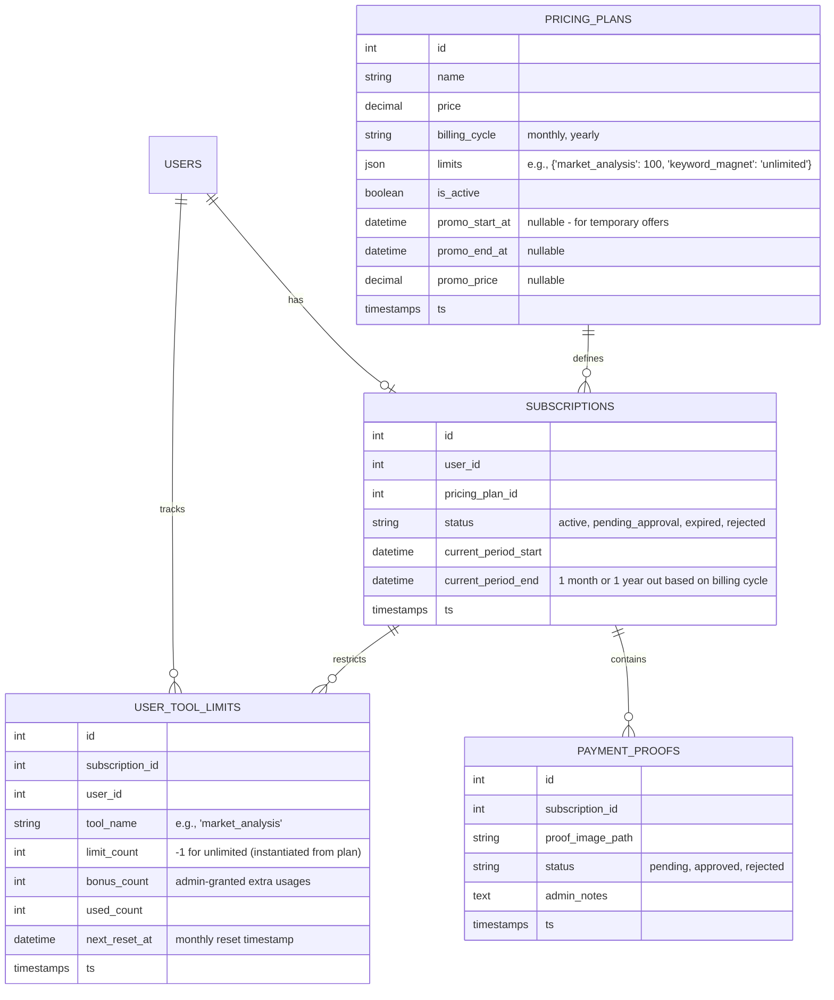

# Implementation Plan: SaaS Pricing Plans, Tool Limits, Upgrades & Payment Proofs

This plan outlines the architecture and implementation for pricing plans, customizable tool limits, upgrades with limit carry-overs, monthly/manual limit resets, and a temporary payment proof upload system (via InstaPay).

---

## Architecture Design

### 1. Database Schema

We will create the following tables in the Laravel backend. Relational tables are used to track pricing plans, subscriptions, individual tool limits (with support for manual admin bonuses), and payment proof submissions.

---

## Key Features & Business Logic

### 2. Immutable User Limits (SaaS Industry Standard)
- **Instantiation on Subscription**: When a user's subscription is approved and activated, the plan's default limits are copied directly into the `USER_TOOL_LIMITS` table.
- **Safety Against Plan Changes**: The gatekeeper middleware checks limits **only** against the user's `USER_TOOL_LIMITS` records (never directly from the `PRICING_PLANS` configuration). 
- If an admin edits a pricing plan's defaults (e.g. changing Plan A from 50 to 100 monthly queries), **existing subscribers on that plan are unaffected**. New limits will only apply to new signups or plan renewals.

### 3. Admin Pricing Plan & Subscriber Customization
- **Admin Panel**: Add, edit, or delete pricing plans.
- **Per-Tool Limits**: For each of the 7 tools, the admin can set:
  - An integer limit (e.g., 50 usages/month).
  - "Unlimited" (represented in database as `-1` or `null`).
- **Direct Limit Overrides**: Admins have full access to a subscriber's `USER_TOOL_LIMITS` and can manually override the base `limit_count` (e.g. increase a subscriber's monthly limit to 100 instead of 50) or add temporary `bonus_count` queries.
- **Temporary Offers**: Plans can have optional `promo_price`, `promo_start_at`, and `promo_end_at` fields. If current time is within the promo window, the system displays the promo price instead of the base plan price.
- **Yearly Plans Support**:
  - Pricing plans support `billing_cycle = 'yearly'` (charging once a year).
  - **SaaS Limit Standard**: Even on yearly plans, the `USER_TOOL_LIMITS` reset cycle runs **monthly**. For example, if a user subscribes yearly, their subscription expires in 1 year, but their tool usage limits reset back to 0 every month (tracked via `next_reset_at`), matching products like Helium 10.

### 4. Subscription Upgrades Without Limit Loss
- When a user upgrades their plan, their current remaining usage limits are carried over:
  - **Carry-over calculation**: `New Limit = New Plan Limit + (Old Plan Limit - Old Plan Used)`.
  - For example, if a user has 30 unused queries on Basic and upgrades to Pro (100 queries), their new limit is adjusted to `130` for the remainder of their billing cycle.

### 5. Limit Resets: Automatic Monthly & Admin Resets
- **Lazy On-Demand Resets**:
  - Every time a user initiates a request to any of the 7 tools, a middleware checks:
    `if (now() > next_reset_at)`
  - If expired, the system dynamically increments `next_reset_at` by 1 month, resets `used_count` to `0`, and saves the updates before proceeding.
- **Admin Manual Reset**:
  - The admin panel will feature a "Reset Limits" button on user profiles to clear usage counts immediately.

### 6. Temporary InstaPay Screenshot Upload System
- **Checkout Process**:
  - The user selects a plan and is shown payment instructions (e.g., "Send to InstaPay username `example@instapay`").
  - The user uploads a screenshot proof of payment.
  - The system creates a subscription in `pending_approval` state.
- **Admin Dashboard Review**:
  - The admin can view a list of pending uploads, inspect the screenshot, write admin notes, and click **Approve** (activates subscription and updates user limits) or **Reject** (notifies user).

---

## Proposed Technical Tasks

### 1. Database Migrations
- Create migration `create_pricing_plans_table`
- Create migration `create_subscriptions_table`
- Create migration `create_user_tool_limits_table`
- Create migration `create_payment_proofs_table`

### 2. Models & Scopes
- Implement relations in `User.php`, `PricingPlan.php`, `Subscription.php`, `UserToolLimit.php`, `PaymentProof.php`.

### 3. Middleware & Gatekeeper
- Create `CheckToolUsage` middleware in Laravel that checks if the request is within the user's active limits.
- The middleware automatically triggers the **Lazy Reset** check if the period has ended.

### 4. Admin Controllers & Views
- Create `AdminPricingController` to manage plans.
- Create `AdminSubscriptionController` to review screenshots, approve/reject payments, and manually reset limits.

### 5. API Endpoints
- `GET /api/subscription/status` - Returns current plan limits and remaining usage.
- `POST /api/subscription/payment-proof` - Allows uploading screenshot.

---

## Verification Plan

### Automated Tests
- Writing unit tests to verify:
  1. Lazy monthly resets activate correctly on expired periods.
  2. Upgrading plans adds the remaining balance to the new limit.
  3. Unlimited tools bypass count checks.

### Manual Verification
- Testing checkout flow by uploading sample images.
- Approving payment via Admin Panel and verifying limits are correctly granted.
