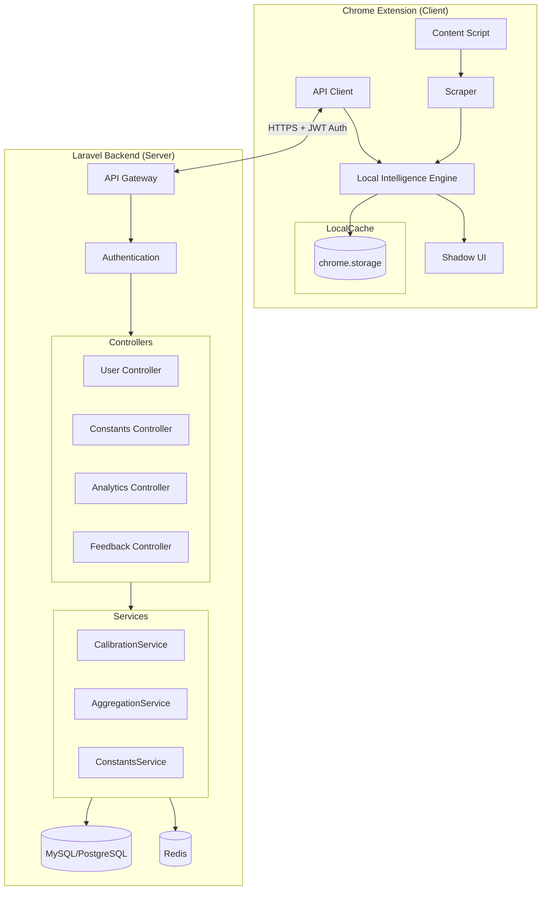
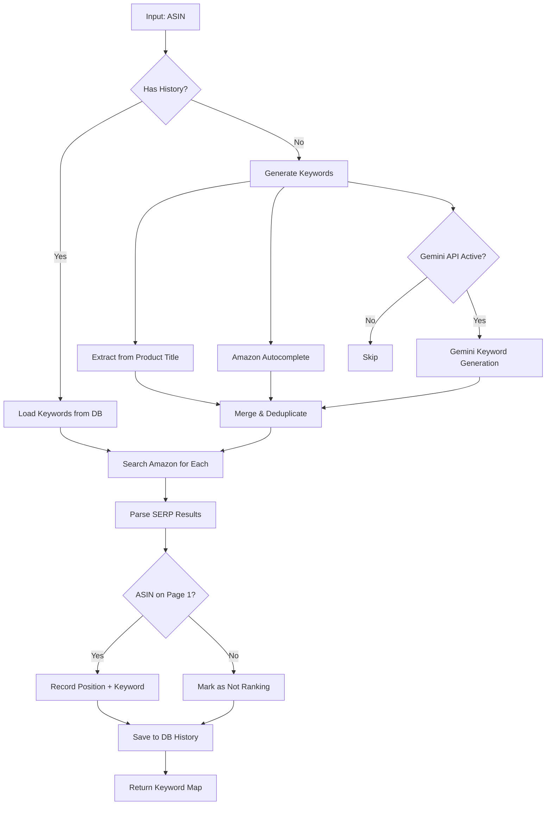

# 🚀 Professional Implementation Plan: Amazon Product Analyzer v2.1

> **Objective**: Develop a high-performance, privacy-focused Chrome Extension that provides Helium 10-level analytics entirely within the browser, with **self-improving algorithms** powered by user data and Amazon signals.

> **Target Markets**: Amazon US (amazon.com) and Amazon Egypt (amazon.eg)

> **Version**: 2.3 | **Last Updated**: January 2025 | **Next Review**: April 2025

---

> [!IMPORTANT]
> **🔐 Authentication Required**: This extension requires user registration and login. All API endpoints (except public read-only endpoints) are protected with Laravel Sanctum JWT authentication. Users must create an account to access analytics, feedback, and personalized features.

---

## 📋 Table of Contents

1. [Architecture Overview](#1-architecture-overview)
2. [Laravel Backend](#2-laravel-backend)
3. [Intelligence Engine (Production-Grade)](#3-intelligence-engine)
4. [Market Constants (Updated 2025)](#4-market-constants)
5. [Edge Case Handling (Complete)](#5-edge-case-handling)
6. [Data Update Schedule](#6-data-update-schedule)
7. [User & Amazon Data Integration](#7-data-integration-system)
8. [Calibration System (With Guardrails)](#8-calibration-system)
9. [Implementation Phases](#9-implementation-phases)
10. [File Structure](#10-file-structure)
11. [Fee Reference Tables](#11-fee-reference)
12. [Known Limitations & Mitigations](#12-known-limitations--mitigations)

---

## 1. Architecture Overview

### Hybrid Architecture: Chrome Extension + Laravel Backend



### Core Modules

| Layer | Module | Responsibility |
|-------|--------|----------------|
| **Extension** | `MarketplaceManager` | Domain detection, currency |
| **Extension** | `DataScraper` | DOM extraction with edge cases |
| **Extension** | `IntelligenceEngine` | Local sales/volume estimation |
| **Extension** | `ApiClient` | Server communication with JWT auth |
| **Extension** | `ShadowUI` | Floating dashboard |
| **Backend** | `AuthController` | User registration, login, JWT tokens |
| **Backend** | `UserController` | User profile management |
| **Backend** | `ConstantsController` | Serve latest algorithm constants |
| **Backend** | `FeedbackController` | Collect user calibration data |
| **Backend** | `AnalyticsController` | Aggregated market insights |
| **Backend** | `CalibrationService` | Cross-user algorithm improvement |

---

## 2. Laravel Backend

### A. API Endpoints

> [!NOTE]
> **User Authentication Required** - API uses JWT tokens for secure authentication. Users must register and login to access the extension features.

#### User Authentication

| Method | Endpoint | Description |
|--------|----------|-------------|
| `POST` | `/api/auth/register` | Register new user account |
| `POST` | `/api/auth/login` | Login and receive JWT token |
| `POST` | `/api/auth/logout` | Logout and invalidate token |
| `GET` | `/api/auth/me` | Get authenticated user profile |
| `POST` | `/api/auth/refresh` | Refresh expired token |
| `POST` | `/api/auth/forgot-password` | Request password reset |
| `POST` | `/api/auth/reset-password` | Reset password with token |

#### Constants & Configuration

| Method | Endpoint | Description |
|--------|----------|-------------|
| `GET` | `/api/constants` | Get all algorithm constants |
| `GET` | `/api/constants/{marketplace}` | Get market-specific constants |
| `GET` | `/api/constants/version` | Check constants version |
| `GET` | `/api/fees/{marketplace}` | Get FBA fee tables |
| `GET` | `/api/seasonality` | Get seasonality multipliers |

#### Feedback & Calibration (Protected)

| Method | Endpoint | Description |
|--------|----------|-------------|
| `POST` | `/api/feedback/sales` | Submit actual sales data (requires auth) |
| `POST` | `/api/feedback/correction` | Submit estimate correction (requires auth) |
| `GET` | `/api/feedback/history` | Get user's feedback history (requires auth) |

#### Analytics

| Method | Endpoint | Description |
|--------|----------|-------------|
| `GET` | `/api/analytics/category/{id}` | Category insights |
| `GET` | `/api/analytics/trends` | Market trends |
| `POST` | `/api/analytics/product` | Analyze scraped product |

#### Keyword Suggestions

| Method | Endpoint | Description |
|--------|----------|-------------|
| `GET` | `/api/keywords/popular/{marketplace}` | Get cached popular keywords |
| `POST` | `/api/keywords/cache` | Cache keyword suggestions from extension |
| `POST` | `/api/search-volume/estimate` | Estimate search volume from SERP data |

#### Search Volume Estimation Strategy

> [!NOTE]
> **BSR Enrichment Strategy**: To improve estimation accuracy when "Monthly Sales" are missing (common on Amazon Egypt):
> 1.  **Top 15 Enrichment**: We strictly limit BSR fetching to the **top 15 organic results** to avoid rate limiting.
> 2.  **Conditional Fetch**: Use `SerpParser.fetchProductBSR(asin)` only if `monthly_sales` is missing.
> 3.  **Data Filtering**: The backend calculation **only** considers products that have either `monthly_sales` or `bsr`. Products with neither are excluded to prevent skewing the data.

---

### B. User Authentication System

> [!IMPORTANT]
> **Authentication Stack**: Laravel Sanctum for SPA authentication with JWT tokens
> Users must create an account and login to use the extension features.

#### Database Schema

```sql
-- Users Table
CREATE TABLE users (
    id BIGINT UNSIGNED PRIMARY KEY AUTO_INCREMENT,
    name VARCHAR(255) NOT NULL,
    email VARCHAR(255) NOT NULL UNIQUE,
    password VARCHAR(255) NOT NULL,
    email_verified_at TIMESTAMP NULL,
    api_token VARCHAR(80) UNIQUE NULL,
    subscription_tier ENUM('free', 'premium', 'enterprise') DEFAULT 'free',
    subscription_expires_at TIMESTAMP NULL,
    created_at TIMESTAMP DEFAULT CURRENT_TIMESTAMP,
    updated_at TIMESTAMP DEFAULT CURRENT_TIMESTAMP ON UPDATE CURRENT_TIMESTAMP,
    
    INDEX idx_email (email),
    INDEX idx_api_token (api_token)
);

-- Password Reset Tokens
CREATE TABLE password_reset_tokens (
    email VARCHAR(255) PRIMARY KEY,
    token VARCHAR(255) NOT NULL,
    created_at TIMESTAMP NULL
);

-- Personal Access Tokens (Sanctum)
CREATE TABLE personal_access_tokens (
    id BIGINT UNSIGNED PRIMARY KEY AUTO_INCREMENT,
    tokenable_type VARCHAR(255) NOT NULL,
    tokenable_id BIGINT UNSIGNED NOT NULL,
    name VARCHAR(255) NOT NULL,
    token VARCHAR(64) NOT NULL UNIQUE,
    abilities TEXT NULL,
    last_used_at TIMESTAMP NULL,
    expires_at TIMESTAMP NULL,
    created_at TIMESTAMP DEFAULT CURRENT_TIMESTAMP,
    updated_at TIMESTAMP DEFAULT CURRENT_TIMESTAMP ON UPDATE CURRENT_TIMESTAMP,
    
    INDEX idx_tokenable (tokenable_type, tokenable_id)
);

-- User Activity Log
CREATE TABLE user_activity_logs (
    id BIGINT UNSIGNED PRIMARY KEY AUTO_INCREMENT,
    user_id BIGINT UNSIGNED NOT NULL,
    action VARCHAR(100) NOT NULL,
    ip_address VARCHAR(45) NULL,
    user_agent TEXT NULL,
    created_at TIMESTAMP DEFAULT CURRENT_TIMESTAMP,
    
    FOREIGN KEY (user_id) REFERENCES users(id) ON DELETE CASCADE,
    INDEX idx_user_action (user_id, action, created_at)
);
```

#### Laravel Authentication Controller

```php
// app/Http/Controllers/Api/AuthController.php
<?php

namespace App\Http\Controllers\Api;

use App\Http\Controllers\Controller;
use App\Models\User;
use Illuminate\Http\Request;
use Illuminate\Support\Facades\Hash;
use Illuminate\Validation\ValidationException;

class AuthController extends Controller
{
    /**
     * Register a new user
     */
    public function register(Request $request)
    {
        $validated = $request->validate([
            'name' => 'required|string|max:255',
            'email' => 'required|string|email|max:255|unique:users',
            'password' => 'required|string|min:8|confirmed',
        ]);

        $user = User::create([
            'name' => $validated['name'],
            'email' => $validated['email'],
            'password' => Hash::make($validated['password']),
            'subscription_tier' => 'free',
        ]);

        $token = $user->createToken('chrome-extension')->plainTextToken;

        return response()->json([
            'user' => $user,
            'token' => $token,
            'message' => 'Registration successful'
        ], 201);
    }

    /**
     * Login user and create token
     */
    public function login(Request $request)
    {
        $request->validate([
            'email' => 'required|email',
            'password' => 'required',
        ]);

        $user = User::where('email', $request->email)->first();

        if (!$user || !Hash::check($request->password, $user->password)) {
            throw ValidationException::withMessages([
                'email' => ['The provided credentials are incorrect.'],
            ]);
        }

        // Revoke previous tokens (optional - single device login)
        // $user->tokens()->delete();

        $token = $user->createToken('chrome-extension')->plainTextToken;

        return response()->json([
            'user' => $user,
            'token' => $token,
            'message' => 'Login successful'
        ]);
    }

    /**
     * Logout user (revoke token)
     */
    public function logout(Request $request)
    {
        $request->user()->currentAccessToken()->delete();

        return response()->json([
            'message' => 'Logged out successfully'
        ]);
    }

    /**
     * Get authenticated user
     */
    public function me(Request $request)
    {
        return response()->json([
            'user' => $request->user()
        ]);
    }

    /**
     * Refresh token
     */
    public function refresh(Request $request)
    {
        $user = $request->user();
        
        // Delete current token
        $request->user()->currentAccessToken()->delete();
        
        // Create new token
        $token = $user->createToken('chrome-extension')->plainTextToken;

        return response()->json([
            'token' => $token,
            'message' => 'Token refreshed successfully'
        ]);
    }

    /**
     * Request password reset
     */
    public function forgotPassword(Request $request)
    {
        $request->validate(['email' => 'required|email']);

        // Generate reset token
        $token = Str::random(64);

        DB::table('password_reset_tokens')->updateOrInsert(
            ['email' => $request->email],
            [
                'token' => Hash::make($token),
                'created_at' => now()
            ]
        );

        // TODO: Send email with reset link
        // Mail::to($request->email)->send(new PasswordResetMail($token));

        return response()->json([
            'message' => 'Password reset link sent to your email'
        ]);
    }

    /**
     * Reset password
     */
    public function resetPassword(Request $request)
    {
        $request->validate([
            'email' => 'required|email',
            'token' => 'required|string',
            'password' => 'required|string|min:8|confirmed',
        ]);

        $reset = DB::table('password_reset_tokens')
            ->where('email', $request->email)
            ->first();

        if (!$reset || !Hash::check($request->token, $reset->token)) {
            throw ValidationException::withMessages([
                'token' => ['Invalid reset token.'],
            ]);
        }

        $user = User::where('email', $request->email)->first();
        $user->password = Hash::make($request->password);
        $user->save();

        // Delete reset token
        DB::table('password_reset_tokens')->where('email', $request->email)->delete();

        return response()->json([
            'message' => 'Password reset successfully'
        ]);
    }
}
```

#### Routes Configuration

```php
// routes/api.php

use App\Http\Controllers\Api\AuthController;
use Illuminate\Support\Facades\Route;

// Public routes (no auth required)
Route::post('/auth/register', [AuthController::class, 'register']);
Route::post('/auth/login', [AuthController::class, 'login']);
Route::post('/auth/forgot-password', [AuthController::class, 'forgotPassword']);
Route::post('/auth/reset-password', [AuthController::class, 'resetPassword']);

// Protected routes (require authentication)
Route::middleware('auth:sanctum')->group(function () {
    Route::post('/auth/logout', [AuthController::class, 'logout']);
    Route::get('/auth/me', [AuthController::class, 'me']);
    Route::post('/auth/refresh', [AuthController::class, 'refresh']);
    
    // All other protected routes
    Route::post('/feedback/sales', [FeedbackController::class, 'submitSales']);
    Route::post('/feedback/correction', [FeedbackController::class, 'submitCorrection']);
    Route::get('/feedback/history', [FeedbackController::class, 'getHistory']);
    
    Route::get('/analytics/category/{id}', [AnalyticsController::class, 'category']);
    Route::get('/analytics/trends', [AnalyticsController::class, 'trends']);
    Route::post('/analytics/product', [AnalyticsController::class, 'analyzeProduct']);
    
    Route::post('/keywords/cache', [KeywordsController::class, 'cache']);
    Route::post('/reverse-asin/ranking', [ReverseAsinController::class, 'submitRanking']);
});

// Public routes (no auth required - read-only)
Route::get('/constants', [ConstantsController::class, 'index']);
Route::get('/constants/{marketplace}', [ConstantsController::class, 'marketplace']);
Route::get('/constants/version', [ConstantsController::class, 'version']);
Route::get('/fees/{marketplace}', [FeesController::class, 'marketplace']);
Route::get('/seasonality', [SeasonalityController::class, 'index']);
Route::get('/keywords/popular/{marketplace}', [KeywordsController::class, 'popular']);
Route::get('/reverse-asin/{asin}/keywords', [ReverseAsinController::class, 'getKeywords']);
```

#### Chrome Extension - Authentication Module

```javascript
// src/auth/auth-manager.js
class AuthManager {
  constructor() {
    this.baseUrl = 'https://api.yourapp.com';
    this.token = null;
    this.user = null;
  }

  /**
   * Initialize auth from storage
   */
  async init() {
    const data = await chrome.storage.local.get(['authToken', 'user']);
    this.token = data.authToken || null;
    this.user = data.user || null;
    
    return this.isAuthenticated();
  }

  /**
   * Register new user
   */
  async register(name, email, password, passwordConfirmation) {
    try {
      const response = await fetch(`${this.baseUrl}/api/auth/register`, {
        method: 'POST',
        headers: {
          'Content-Type': 'application/json',
          'Accept': 'application/json',
        },
        body: JSON.stringify({
          name,
          email,
          password,
          password_confirmation: passwordConfirmation
        })
      });

      if (!response.ok) {
        const error = await response.json();
        throw new Error(error.message || 'Registration failed');
      }

      const data = await response.json();
      await this.saveAuth(data.token, data.user);
      
      return { success: true, user: data.user };
    } catch (error) {
      return { success: false, error: error.message };
    }
  }

  /**
   * Login user
   */
  async login(email, password) {
    try {
      const response = await fetch(`${this.baseUrl}/api/auth/login`, {
        method: 'POST',
        headers: {
          'Content-Type': 'application/json',
          'Accept': 'application/json',
        },
        body: JSON.stringify({ email, password })
      });

      if (!response.ok) {
        const error = await response.json();
        throw new Error(error.message || 'Login failed');
      }

      const data = await response.json();
      await this.saveAuth(data.token, data.user);
      
      return { success: true, user: data.user };
    } catch (error) {
      return { success: false, error: error.message };
    }
  }

  /**
   * Logout user
   */
  async logout() {
    if (this.token) {
      try {
        await fetch(`${this.baseUrl}/api/auth/logout`, {
          method: 'POST',
          headers: {
            'Authorization': `Bearer ${this.token}`,
            'Accept': 'application/json',
          }
        });
      } catch (error) {
        console.error('Logout error:', error);
      }
    }

    await this.clearAuth();
  }

  /**
   * Get current user
   */
  async getCurrentUser() {
    if (!this.token) return null;

    try {
      const response = await fetch(`${this.baseUrl}/api/auth/me`, {
        headers: {
          'Authorization': `Bearer ${this.token}`,
          'Accept': 'application/json',
        }
      });

      if (!response.ok) {
        await this.clearAuth();
        return null;
      }

      const data = await response.json();
      this.user = data.user;
      await chrome.storage.local.set({ user: this.user });
      
      return this.user;
    } catch (error) {
      console.error('Get user error:', error);
      return null;
    }
  }

  /**
   * Refresh token
   */
  async refreshToken() {
    if (!this.token) return false;

    try {
      const response = await fetch(`${this.baseUrl}/api/auth/refresh`, {
        method: 'POST',
        headers: {
          'Authorization': `Bearer ${this.token}`,
          'Accept': 'application/json',
        }
      });

      if (!response.ok) {
        await this.clearAuth();
        return false;
      }

      const data = await response.json();
      await this.saveAuth(data.token, this.user);
      
      return true;
    } catch (error) {
      console.error('Token refresh error:', error);
      return false;
    }
  }

  /**
   * Check if user is authenticated
   */
  isAuthenticated() {
    return this.token !== null && this.user !== null;
  }

  /**
   * Get auth token for API requests
   */
  getToken() {
    return this.token;
  }

  /**
   * Save authentication data
   */
  async saveAuth(token, user) {
    this.token = token;
    this.user = user;
    
    await chrome.storage.local.set({
      authToken: token,
      user: user
    });
  }

  /**
   * Clear authentication data
   */
  async clearAuth() {
    this.token = null;
    this.user = null;
    
    await chrome.storage.local.remove(['authToken', 'user']);
  }

  /**
   * Make authenticated API request
   */
  async request(method, endpoint, body = null) {
    if (!this.token) {
      throw new Error('Not authenticated');
    }

    const options = {
      method,
      headers: {
        'Authorization': `Bearer ${this.token}`,
        'Accept': 'application/json',
        'Content-Type': 'application/json',
      }
    };

    if (body) {
      options.body = JSON.stringify(body);
    }

    try {
      const response = await fetch(`${this.baseUrl}${endpoint}`, options);

      // Handle 401 - try to refresh token
      if (response.status === 401) {
        const refreshed = await this.refreshToken();
        if (refreshed) {
          // Retry request with new token
          options.headers['Authorization'] = `Bearer ${this.token}`;
          return await fetch(`${this.baseUrl}${endpoint}`, options);
        } else {
          throw new Error('Session expired. Please login again.');
        }
      }

      return response;
    } catch (error) {
      console.error('API request error:', error);
      throw error;
    }
  }
}

export default new AuthManager();
```

#### Extension Login UI

```html
<!-- src/popup/login.html -->
<!DOCTYPE html>
<html lang="en">
<head>
    <meta charset="UTF-8">
    <meta name="viewport" content="width=device-width, initial-scale=1.0">
    <title>Amazon Analyzer - Login</title>
    <link rel="stylesheet" href="styles.css">
</head>
<body>
    <div class="auth-container">
        <div class="auth-header">
            <h1>🔍 Amazon Product Analyzer</h1>
            <p>Login to access premium analytics</p>
        </div>

        <div id="loginForm" class="auth-form">
            <input type="email" id="loginEmail" placeholder="Email" required>
            <input type="password" id="loginPassword" placeholder="Password" required>
            <button id="loginBtn" class="btn-primary">Login</button>
            <div class="form-footer">
                <a href="#" id="showRegister">Create account</a>
                <a href="#" id="forgotPassword">Forgot password?</a>
            </div>
        </div>

        <div id="registerForm" class="auth-form hidden">
            <input type="text" id="registerName" placeholder="Full Name" required>
            <input type="email" id="registerEmail" placeholder="Email" required>
            <input type="password" id="registerPassword" placeholder="Password (min 8 chars)" required>
            <input type="password" id="registerPasswordConfirm" placeholder="Confirm Password" required>
            <button id="registerBtn" class="btn-primary">Create Account</button>
            <div class="form-footer">
                <a href="#" id="showLogin">Already have an account?</a>
            </div>
        </div>

        <div id="message" class="message"></div>
    </div>

    <script src="auth.js"></script>
</body>
</html>
```

```javascript
// src/popup/auth.js
import AuthManager from '../auth/auth-manager.js';

document.addEventListener('DOMContentLoaded', async () => {
  const loginForm = document.getElementById('loginForm');
  const registerForm = document.getElementById('registerForm');
  const message = document.getElementById('message');

  // Check if already logged in
  const isAuth = await AuthManager.init();
  if (isAuth) {
    window.location.href = 'popup.html';
    return;
  }

  // Login
  document.getElementById('loginBtn').addEventListener('click', async () => {
    const email = document.getElementById('loginEmail').value;
    const password = document.getElementById('loginPassword').value;

    if (!email || !password) {
      showMessage('Please fill in all fields', 'error');
      return;
    }

    const result = await AuthManager.login(email, password);
    
    if (result.success) {
      showMessage('Login successful!', 'success');
      setTimeout(() => window.location.href = 'popup.html', 1000);
    } else {
      showMessage(result.error, 'error');
    }
  });

  // Register
  document.getElementById('registerBtn').addEventListener('click', async () => {
    const name = document.getElementById('registerName').value;
    const email = document.getElementById('registerEmail').value;
    const password = document.getElementById('registerPassword').value;
    const passwordConfirm = document.getElementById('registerPasswordConfirm').value;

    if (!name || !email || !password || !passwordConfirm) {
      showMessage('Please fill in all fields', 'error');
      return;
    }

    if (password !== passwordConfirm) {
      showMessage('Passwords do not match', 'error');
      return;
    }

    const result = await AuthManager.register(name, email, password, passwordConfirm);
    
    if (result.success) {
      showMessage('Registration successful!', 'success');
      setTimeout(() => window.location.href = 'popup.html', 1000);
    } else {
      showMessage(result.error, 'error');
    }
  });

  // Toggle forms
  document.getElementById('showRegister').addEventListener('click', (e) => {
    e.preventDefault();
    loginForm.classList.add('hidden');
    registerForm.classList.remove('hidden');
  });

  document.getElementById('showLogin').addEventListener('click', (e) => {
    e.preventDefault();
    registerForm.classList.add('hidden');
    loginForm.classList.remove('hidden');
  });

  function showMessage(text, type) {
    message.textContent = text;
    message.className = `message ${type}`;
    setTimeout(() => message.textContent = '', 3000);
  }
});
```

---

### C. Amazon Keyword Suggestions API (Client-Side)

> [!NOTE]
> The extension calls Amazon's autocomplete API **directly** (no CORS issues for extensions).
> Results are displayed to user and optionally cached on our backend.

**Amazon Autocomplete Endpoint:**

```
GET https://www.amazon.{tld}/suggestions
```

**Parameters:**

| Param | Value | Description |
|-------|-------|-------------|
| `prefix` | `{keyword}` | Search term |
| `alias` | `aps` | Search scope (all departments) |
| `limit` | `11` | Max suggestions |
| `suggestion-type` | `KEYWORD` | Type filter |
| `page-type` | `Search` | Context |
| `site-variant` | `desktop` | Device type |
| `session-id` | `{from cookies}` | Amazon session |
| `mid` | `{marketplace_id}` | Market identifier |

**Response Structure:**

```json
{
  "prefix": "kitchen scale",
  "suggestions": [
    { "value": "kitchen scale digital", "type": "KEYWORD" },
    { "value": "kitchen scale 10kg", "type": "KEYWORD" },
    { "value": "kitchen scale 0.1g", "type": "KEYWORD" },
    { "value": "kitchen scale ميزان حساس", "type": "KEYWORD" }
  ]
}
```

**Extension Implementation:**

```javascript
// src/api/keywords.js
class KeywordSuggestions {
  constructor(marketplace) {
    this.marketplace = marketplace;
    this.tld = marketplace === 'amazon.eg' ? 'eg' : 'com';
    this.mid = marketplace === 'amazon.eg' ? 'ARBP9OOSHTCHU' : 'ATVPDKIKX0DER';
  }

  async getSuggestions(prefix) {
    const sessionId = await this.getSessionId();
    
    const params = new URLSearchParams({
      prefix,
      alias: 'aps',
      limit: '11',
      'suggestion-type': 'KEYWORD',
      'page-type': 'Search',
      'site-variant': 'desktop',
      version: '3',
      'session-id': sessionId,
      mid: this.mid
    });

    const url = `https://www.amazon.${this.tld}/suggestions?${params}`;
    
    try {
      const response = await fetch(url);
      const data = await response.json();
      
      return data.suggestions
        .filter(s => s.type === 'KEYWORD')
        .map(s => ({
          keyword: s.value,
          source: 'amazon_autocomplete'
        }));
    } catch (error) {
      console.error('Keyword suggestion error:', error);
      return [];
    }
  }

  async getSessionId() {
    // Get session-id from Amazon cookies
    const cookies = await chrome.cookies.get({
      url: `https://www.amazon.${this.tld}`,
      name: 'session-id'
    });
    return cookies?.value || this.generateSessionId();
  }

  generateSessionId() {
    // Fallback: generate session-like ID
    return `${Date.now()}-${Math.random().toString(36).substr(2, 9)}`;
  }
}

export default KeywordSuggestions;
```

**Keyword Caching (Backend):**

```php
// app/Http/Controllers/Api/KeywordsController.php
<?php

namespace App\Http\Controllers\Api;

use App\Http\Controllers\Controller;
use App\Models\KeywordCache;
use Illuminate\Http\Request;

class KeywordsController extends Controller
{
    public function popular(string $marketplace)
    {
        return KeywordCache::where('marketplace', $marketplace)
            ->orderByDesc('search_count')
            ->limit(100)
            ->get(['keyword', 'search_count', 'category']);
    }
    
    public function cache(Request $request)
    {
        $validated = $request->validate([
            'marketplace' => 'required|string',
            'keywords' => 'required|array',
            'keywords.*.keyword' => 'required|string|max:255',
            'keywords.*.category' => 'nullable|string|max:100',
        ]);
        
        foreach ($validated['keywords'] as $kw) {
            KeywordCache::updateOrCreate(
                [
                    'marketplace' => $validated['marketplace'],
                    'keyword' => $kw['keyword']
                ],
                [
                    'category' => $kw['category'] ?? null,
                    'search_count' => \DB::raw('search_count + 1'),
                    'last_seen_at' => now()
                ]
            );
        }
        
        return response()->json(['cached' => count($validated['keywords'])]);
    }
}
```

**Database Table:**

```sql
CREATE TABLE keyword_cache (
    id BIGINT UNSIGNED PRIMARY KEY AUTO_INCREMENT,
    marketplace VARCHAR(20) NOT NULL,
    keyword VARCHAR(255) NOT NULL,
    category VARCHAR(100) NULL,
    search_count INT DEFAULT 1,
    last_seen_at TIMESTAMP NULL,
    created_at TIMESTAMP DEFAULT CURRENT_TIMESTAMP,
    
    UNIQUE KEY uk_marketplace_keyword (marketplace, keyword),
    INDEX idx_search_count (marketplace, search_count DESC)
);
```

---

### C. Reverse ASIN (Keyword Discovery)

> [!NOTE]
> **Reverse ASIN** finds keywords that an ASIN ranks for by:
> 1. Generating likely keywords (from product title, Gemini AI, or Amazon suggestions)
> 2. Searching Amazon for each keyword
> 3. Detecting if the ASIN appears on Page 1
> 4. Building a keyword-to-ranking map that improves over time

#### Algorithm Flow



#### API Endpoints

| Method | Endpoint | Description |
|--------|----------|-------------|
| `POST` | `/api/reverse-asin/analyze` | Start reverse ASIN analysis |
| `GET` | `/api/reverse-asin/{asin}/keywords` | Get keyword history for ASIN |
| `POST` | `/api/reverse-asin/ranking` | Submit ranking detection from extension |

#### Extension Implementation

```javascript
// src/engine/reverse-asin.js
class ReverseASIN {
  constructor(marketplace, apiClient, geminiApiKey = null) {
    this.marketplace = marketplace;
    this.apiClient = apiClient;
    this.geminiApiKey = geminiApiKey;
    this.tld = marketplace === 'amazon.eg' ? 'eg' : 'com';
  }

  async analyze(asin, productTitle, category) {
    // Step 1: Check for existing history
    const history = await this.apiClient.request('GET', `/api/reverse-asin/${asin}/keywords`);
    
    let keywords = [];
    
    if (history?.keywords?.length > 0) {
      // Use historical keywords
      keywords = history.keywords.map(k => k.keyword);
    } else {
      // Generate keywords from multiple sources
      keywords = await this.generateKeywords(productTitle, category);
    }

    // Step 2: Search and detect rankings
    const results = await this.searchAndDetect(asin, keywords);

    // Step 3: Save to backend
    await this.saveResults(asin, results);

    return results;
  }

  async generateKeywords(productTitle, category) {
    const keywords = new Set();

    // Source 1: Extract from product title
    const titleKeywords = this.extractFromTitle(productTitle);
    titleKeywords.forEach(k => keywords.add(k));

    // Source 2: Amazon Autocomplete for each title keyword
    for (const baseKeyword of titleKeywords.slice(0, 3)) {
      const suggestions = await this.getAmazonSuggestions(baseKeyword);
      suggestions.forEach(s => keywords.add(s));
    }

    // Source 3: Gemini API (if activated)
    if (this.geminiApiKey) {
      const aiKeywords = await this.generateWithGemini(productTitle, category);
      aiKeywords.forEach(k => keywords.add(k));
    }

    return Array.from(keywords);
  }

  extractFromTitle(title) {
    // Remove brand, size, color variations
    const cleaned = title
      .replace(/\([^)]*\)/g, '')           // Remove parentheses
      .replace(/\[[^\]]*\]/g, '')           // Remove brackets
      .replace(/\b\d+\s*(pack|pcs|pieces?|count)\b/gi, '')
      .trim();

    const words = cleaned.split(/\s+/);
    const keywords = [];

    // Generate 2-4 word combinations
    for (let len = 2; len <= Math.min(4, words.length); len++) {
      for (let i = 0; i <= words.length - len; i++) {
        keywords.push(words.slice(i, i + len).join(' ').toLowerCase());
      }
    }

    return keywords.slice(0, 10); // Top 10 combinations
  }

  async getAmazonSuggestions(prefix) {
    const params = new URLSearchParams({
      prefix,
      alias: 'aps',
      limit: '10',
      'suggestion-type': 'KEYWORD'
    });

    try {
      const response = await fetch(
        `https://www.amazon.${this.tld}/suggestions?${params}`
      );
      const data = await response.json();
      return data.suggestions?.map(s => s.value) || [];
    } catch (error) {
      return [];
    }
  }

  async generateWithGemini(productTitle, category) {
    if (!this.geminiApiKey) return [];

    const prompt = `Generate 15 Amazon search keywords that shoppers would use to find this product:
Title: "${productTitle}"
Category: ${category}
Market: Amazon ${this.marketplace === 'amazon.eg' ? 'Egypt' : 'US'}

Return ONLY a JSON array of keyword strings, no explanation.
Include: main keywords, long-tail variations, feature-based keywords.
For Egypt market, include Arabic transliterations if relevant.`;

    try {
      const response = await fetch(
        `https://generativelanguage.googleapis.com/v1beta/models/gemini-pro:generateContent?key=${this.geminiApiKey}`,
        {
          method: 'POST',
          headers: { 'Content-Type': 'application/json' },
          body: JSON.stringify({
            contents: [{ parts: [{ text: prompt }] }]
          })
        }
      );

      const data = await response.json();
      const text = data.candidates?.[0]?.content?.parts?.[0]?.text || '[]';
      
      // Parse JSON array from response
      const match = text.match(/\[[\s\S]*\]/);
      return match ? JSON.parse(match[0]) : [];
    } catch (error) {
      console.error('Gemini API error:', error);
      return [];
    }
  }

  async searchAndDetect(targetAsin, keywords) {
    const results = [];
    const DELAY_MS = 1500; // Rate limiting

    for (const keyword of keywords) {
      await this.delay(DELAY_MS);

      try {
        const ranking = await this.searchAndFindPosition(targetAsin, keyword);
        results.push({
          keyword,
          ...ranking
        });
      } catch (error) {
        results.push({
          keyword,
          found: false,
          error: error.message
        });
      }
    }

    return results;
  }

  async searchAndFindPosition(targetAsin, keyword) {
    const searchUrl = `https://www.amazon.${this.tld}/s?k=${encodeURIComponent(keyword)}`;
    
    // Fetch search results page
    const response = await fetch(searchUrl);
    const html = await response.text();

    // Parse ASINs from search results
    const asinMatches = html.matchAll(/data-asin="([A-Z0-9]{10})"/g);
    const asins = [...asinMatches].map(m => m[1]).filter(a => a);

    const position = asins.indexOf(targetAsin);

    if (position !== -1) {
      return {
        found: true,
        position: position + 1,
        page: 1,
        totalResults: asins.length,
        isSponsored: this.checkIfSponsored(html, targetAsin),
        checkedAt: new Date().toISOString()
      };
    }

    return {
      found: false,
      position: null,
      page: 1,
      checkedAt: new Date().toISOString()
    };
  }

  checkIfSponsored(html, asin) {
    // Check if the ASIN result has sponsored label
    const sponsoredPattern = new RegExp(
      `data-asin="${asin}"[^>]*>[\\s\\S]*?Sponsored`,
      'i'
    );
    return sponsoredPattern.test(html);
  }

  async saveResults(asin, results) {
    await this.apiClient.request('POST', '/api/reverse-asin/ranking', {
      asin,
      marketplace: this.marketplace,
      results
    });
  }

  delay(ms) {
    return new Promise(resolve => setTimeout(resolve, ms));
  }
}

export default ReverseASIN;
```

#### Backend Controller

```php
// app/Http/Controllers/Api/ReverseAsinController.php
<?php

namespace App\Http\Controllers\Api;

use App\Http\Controllers\Controller;
use App\Models\AsinKeywordRanking;
use Illuminate\Http\Request;

class ReverseAsinController extends Controller
{
    public function getKeywords(string $asin)
    {
        $keywords = AsinKeywordRanking::where('asin', $asin)
            ->where('found', true)
            ->orderBy('position')
            ->get(['keyword', 'position', 'is_sponsored', 'checked_at']);

        $notRanking = AsinKeywordRanking::where('asin', $asin)
            ->where('found', false)
            ->orderByDesc('checked_at')
            ->limit(20)
            ->get(['keyword', 'checked_at']);

        return response()->json([
            'asin' => $asin,
            'ranking_keywords' => $keywords,
            'not_ranking' => $notRanking,
            'last_updated' => $keywords->max('checked_at')
        ]);
    }

    public function submitRanking(Request $request)
    {
        $validated = $request->validate([
            'asin' => 'required|string|max:20',
            'marketplace' => 'required|string',
            'results' => 'required|array',
            'results.*.keyword' => 'required|string|max:255',
            'results.*.found' => 'required|boolean',
            'results.*.position' => 'nullable|integer',
            'results.*.is_sponsored' => 'nullable|boolean',
        ]);

        foreach ($validated['results'] as $result) {
            AsinKeywordRanking::updateOrCreate(
                [
                    'asin' => $validated['asin'],
                    'marketplace' => $validated['marketplace'],
                    'keyword' => $result['keyword']
                ],
                [
                    'found' => $result['found'],
                    'position' => $result['position'] ?? null,
                    'is_sponsored' => $result['is_sponsored'] ?? false,
                    'checked_at' => now()
                ]
            );
        }

        return response()->json([
            'saved' => count($validated['results']),
            'asin' => $validated['asin']
        ]);
    }
}
```

#### Database Tables

```sql
-- ASIN Keyword Rankings (History)
CREATE TABLE asin_keyword_rankings (
    id BIGINT UNSIGNED PRIMARY KEY AUTO_INCREMENT,
    asin VARCHAR(20) NOT NULL,
    marketplace VARCHAR(20) NOT NULL,
    keyword VARCHAR(255) NOT NULL,
    found BOOLEAN DEFAULT FALSE,
    position TINYINT UNSIGNED NULL,
    is_sponsored BOOLEAN DEFAULT FALSE,
    checked_at TIMESTAMP NOT NULL,
    created_at TIMESTAMP DEFAULT CURRENT_TIMESTAMP,
    
    UNIQUE KEY uk_asin_marketplace_keyword (asin, marketplace, keyword),
    INDEX idx_asin_found (asin, found, position),
    INDEX idx_keyword (keyword)
);

-- Gemini API Configuration (per device)
CREATE TABLE gemini_config (
    id BIGINT UNSIGNED PRIMARY KEY AUTO_INCREMENT,
    device_id VARCHAR(64) NOT NULL,
    api_key_encrypted VARCHAR(500) NOT NULL,
    is_active BOOLEAN DEFAULT TRUE,
    requests_today INT DEFAULT 0,
    last_request_at TIMESTAMP NULL,
    created_at TIMESTAMP DEFAULT CURRENT_TIMESTAMP,
    
    UNIQUE KEY uk_device (device_id)
);
```

#### Routes Update

```php
// Add to routes/api.php

// Reverse ASIN
Route::get('/reverse-asin/{asin}/keywords', [ReverseAsinController::class, 'getKeywords']);
Route::post('/reverse-asin/ranking', [ReverseAsinController::class, 'submitRanking']);

// Gemini Config
Route::post('/gemini/configure', [GeminiController::class, 'configure']);
Route::get('/gemini/{device_id}/status', [GeminiController::class, 'status']);
```

#### Extension UI Component

```javascript
// src/ui/panels/reverse-asin.js
class ReverseAsinPanel {
  render(results) {
    const rankingKeywords = results.filter(r => r.found);
    const notRanking = results.filter(r => !r.found);

    return `
      <div class="reverse-asin-results">
        <h3>🎯 Ranking Keywords (${rankingKeywords.length})</h3>
        <table class="keyword-table">
          <thead>
            <tr>
              <th>Keyword</th>
              <th>Position</th>
              <th>Type</th>
            </tr>
          </thead>
          <tbody>
            ${rankingKeywords.map(r => `
              <tr class="${r.position <= 3 ? 'top-3' : ''}">
                <td>${r.keyword}</td>
                <td>#${r.position}</td>
                <td>${r.isSponsored ? '💰 Sponsored' : '🌿 Organic'}</td>
              </tr>
            `).join('')}
          </tbody>
        </table>

        <h3>❌ Not Ranking (${notRanking.length})</h3>
        <div class="not-ranking-keywords">
          ${notRanking.map(r => `<span class="keyword-chip">${r.keyword}</span>`).join('')}
        </div>
      </div>
    `;
  }
}
```

---

### D. Keyword Difficulty Score (KD)

> [!NOTE]
> **KD Score (0-100)** combines multiple competition signals into a single, actionable number.
> Higher = harder to rank. Based on Helium 10's methodology but fully transparent.

#### KD Formula

```
KD = (ListingStrength × 0.35) + (AdDensity × 0.25) + (ReviewBarrier × 0.25) + (BrandDominance × 0.15)
```

| Component | Weight | Calculation |
|-----------|--------|-------------|
| **Listing Strength** | 35% | Avg reviews × avg rating of top 10 |
| **Ad Density** | 25% | % of page 1 that is sponsored |
| **Review Barrier** | 25% | Median reviews needed to compete |
| **Brand Dominance** | 15% | % of top 10 owned by 1-2 brands |

#### Extension Implementation

```javascript
// src/engine/keyword-difficulty.js
class KeywordDifficulty {
  calculate(serpResults) {
    const top10 = serpResults.slice(0, 10);
    
    // 1. Listing Strength (0-100)
    const avgReviews = this.average(top10.map(p => p.reviewCount || 0));
    const avgRating = this.average(top10.map(p => p.rating || 0));
    const listingStrength = Math.min(100, (avgReviews / 50) * (avgRating / 5) * 100);
    
    // 2. Ad Density (0-100)
    const sponsoredCount = top10.filter(p => p.isSponsored).length;
    const adDensity = (sponsoredCount / 10) * 100;
    
    // 3. Review Barrier (0-100)
    const sortedReviews = top10.map(p => p.reviewCount || 0).sort((a, b) => a - b);
    const medianReviews = sortedReviews[Math.floor(sortedReviews.length / 2)];
    const reviewBarrier = Math.min(100, (medianReviews / 500) * 100);
    
    // 4. Brand Dominance (0-100)
    const brands = top10.map(p => p.brand?.toLowerCase() || 'unknown');
    const brandCounts = {};
    brands.forEach(b => brandCounts[b] = (brandCounts[b] || 0) + 1);
    const topBrandShare = Math.max(...Object.values(brandCounts)) / 10;
    const brandDominance = topBrandShare * 100;
    
    // Calculate final KD
    const kd = Math.round(
      (listingStrength * 0.35) +
      (adDensity * 0.25) +
      (reviewBarrier * 0.25) +
      (brandDominance * 0.15)
    );
    
    return {
      score: Math.min(100, Math.max(0, kd)),
      breakdown: {
        listingStrength: Math.round(listingStrength),
        adDensity: Math.round(adDensity),
        reviewBarrier: Math.round(reviewBarrier),
        brandDominance: Math.round(brandDominance)
      },
      difficulty: this.getDifficultyLabel(kd),
      recommendation: this.getRecommendation(kd)
    };
  }
  
  getDifficultyLabel(kd) {
    if (kd < 20) return { label: 'Very Easy', color: '#22c55e' };
    if (kd < 40) return { label: 'Easy', color: '#84cc16' };
    if (kd < 60) return { label: 'Moderate', color: '#eab308' };
    if (kd < 80) return { label: 'Hard', color: '#f97316' };
    return { label: 'Very Hard', color: '#ef4444' };
  }
  
  getRecommendation(kd) {
    if (kd < 30) return 'Good opportunity for new sellers';
    if (kd < 50) return 'Achievable with quality listing and some reviews';
    if (kd < 70) return 'Requires PPC investment and strong differentiation';
    return 'Dominated by established brands — consider long-tail alternatives';
  }
  
  average(arr) {
    return arr.length ? arr.reduce((a, b) => a + b, 0) / arr.length : 0;
  }
}

export default KeywordDifficulty;
```

#### Database Table

```sql
CREATE TABLE keyword_difficulty (
    id BIGINT UNSIGNED PRIMARY KEY AUTO_INCREMENT,
    keyword VARCHAR(255) NOT NULL,
    marketplace VARCHAR(20) NOT NULL,
    kd_score TINYINT UNSIGNED NOT NULL,
    listing_strength TINYINT UNSIGNED NOT NULL,
    ad_density TINYINT UNSIGNED NOT NULL,
    review_barrier TINYINT UNSIGNED NOT NULL,
    brand_dominance TINYINT UNSIGNED NOT NULL,
    calculated_at TIMESTAMP NOT NULL,
    
    UNIQUE KEY uk_keyword_marketplace (keyword, marketplace),
    INDEX idx_kd_score (marketplace, kd_score)
);
```

---

### E. Keyword Clustering (Topic Buckets)

> [!NOTE]
> **Keyword Clustering** groups related keywords into parent/child hierarchies
> and semantic clusters for better PPC campaign organization.

#### Clustering Methods

| Method | Description | Use Case |
|--------|-------------|----------|
| **N-gram Overlap** | Group by shared word sequences | "kitchen scale" → "kitchen scale digital", "kitchen scale 10kg" |
| **Semantic Similarity** | Group by meaning (Gemini API) | "weighing machine" ↔ "kitchen scale" |
| **Search Intent** | Group by buyer intent | Informational vs Transactional |

#### Extension Implementation

```javascript
// src/engine/keyword-clustering.js
class KeywordClustering {
  constructor(geminiApiKey = null) {
    this.geminiApiKey = geminiApiKey;
  }

  async cluster(keywords) {
    // Step 1: N-gram based clustering (fast, no API)
    const ngramClusters = this.clusterByNgram(keywords);
    
    // Step 2: Semantic clustering (if Gemini available)
    if (this.geminiApiKey) {
      return await this.enhanceWithSemantic(ngramClusters);
    }
    
    return ngramClusters;
  }

  clusterByNgram(keywords) {
    const clusters = {};
    
    keywords.forEach(keyword => {
      const words = keyword.toLowerCase().split(/\s+/);
      
      // Find best parent (longest common prefix with existing clusters)
      let bestParent = null;
      let bestScore = 0;
      
      for (const parent of Object.keys(clusters)) {
        const parentWords = parent.split(/\s+/);
        const overlap = this.getOverlap(words, parentWords);
        if (overlap > bestScore && overlap >= 2) {
          bestScore = overlap;
          bestParent = parent;
        }
      }
      
      if (bestParent) {
        clusters[bestParent].children.push(keyword);
      } else {
        // Create new cluster with 2-word base
        const base = words.slice(0, 2).join(' ');
        if (!clusters[base]) {
          clusters[base] = { parent: base, children: [], intent: 'unknown' };
        }
        if (keyword !== base) {
          clusters[base].children.push(keyword);
        }
      }
    });
    
    // Classify intent for each cluster
    for (const cluster of Object.values(clusters)) {
      cluster.intent = this.classifyIntent(cluster.parent, cluster.children);
      cluster.volume = cluster.children.length + 1;
    }
    
    return Object.values(clusters);
  }

  getOverlap(words1, words2) {
    let overlap = 0;
    const minLen = Math.min(words1.length, words2.length);
    for (let i = 0; i < minLen; i++) {
      if (words1[i] === words2[i]) overlap++;
      else break;
    }
    return overlap;
  }

  classifyIntent(parent, children) {
    const allKeywords = [parent, ...children].join(' ').toLowerCase();
    
    // Transactional signals
    if (/buy|price|cheap|deal|best|top|review/.test(allKeywords)) {
      return 'transactional';
    }
    
    // Informational signals
    if (/how|what|why|guide|tutorial|vs|difference/.test(allKeywords)) {
      return 'informational';
    }
    
    // Navigational signals
    if (/brand|amazon|official/.test(allKeywords)) {
      return 'navigational';
    }
    
    return 'commercial'; // Default for product searches
  }

  async enhanceWithSemantic(clusters) {
    const prompt = `Group these keyword clusters by semantic similarity. 
Merge clusters that mean the same thing (e.g., "weighing scale" and "kitchen scale").
Return JSON: { "merged": [{ "parent": "...", "aliases": [...], "children": [...] }] }

Clusters: ${JSON.stringify(clusters.map(c => c.parent))}`;

    try {
      const response = await fetch(
        `https://generativelanguage.googleapis.com/v1beta/models/gemini-pro:generateContent?key=${this.geminiApiKey}`,
        {
          method: 'POST',
          headers: { 'Content-Type': 'application/json' },
          body: JSON.stringify({ contents: [{ parts: [{ text: prompt }] }] })
        }
      );
      
      const data = await response.json();
      const text = data.candidates?.[0]?.content?.parts?.[0]?.text || '{}';
      const match = text.match(/\{[\s\S]*\}/);
      
      if (match) {
        const merged = JSON.parse(match[0]);
        return this.applySemanticMerge(clusters, merged);
      }
    } catch (error) {
      console.error('Semantic clustering error:', error);
    }
    
    return clusters;
  }

  applySemanticMerge(clusters, semanticResult) {
    // Merge clusters based on Gemini's semantic grouping
    if (!semanticResult.merged) return clusters;
    
    const mergedClusters = [];
    const usedParents = new Set();
    
    for (const merge of semanticResult.merged) {
      const relatedClusters = clusters.filter(c => 
        merge.aliases?.includes(c.parent) || c.parent === merge.parent
      );
      
      if (relatedClusters.length > 0) {
        mergedClusters.push({
          parent: merge.parent,
          aliases: merge.aliases || [],
          children: relatedClusters.flatMap(c => c.children),
          intent: relatedClusters[0].intent,
          volume: relatedClusters.reduce((sum, c) => sum + c.volume, 0)
        });
        relatedClusters.forEach(c => usedParents.add(c.parent));
      }
    }
    
    // Add remaining clusters
    clusters.forEach(c => {
      if (!usedParents.has(c.parent)) {
        mergedClusters.push(c);
      }
    });
    
    return mergedClusters;
  }
}

export default KeywordClustering;
```

#### API Endpoint

```php
// Add to KeywordsController.php

public function cluster(Request $request)
{
    $validated = $request->validate([
        'keywords' => 'required|array|min:2',
        'keywords.*' => 'string|max:255',
    ]);
    
    // Simple N-gram clustering on server side
    $clusters = $this->clusterKeywords($validated['keywords']);
    
    return response()->json([
        'clusters' => $clusters,
        'total_keywords' => count($validated['keywords']),
        'total_clusters' => count($clusters)
    ]);
}
```

---

### F. PPC-Oriented Keyword Suggestions

> [!NOTE]
> **PPC Keywords** are optimized for Amazon advertising with bid estimates,
> match type recommendations, and campaign structure suggestions.

#### PPC Keyword Output

```javascript
{
  keyword: "kitchen scale digital",
  ppc: {
    suggestedBid: { min: 0.35, max: 0.75, currency: "USD" },
    matchTypes: {
      exact: { recommended: true, competitiveness: "medium" },
      phrase: { recommended: true, competitiveness: "low" },
      broad: { recommended: false, reason: "Too generic" }
    },
    estimatedCPC: 0.52,
    estimatedImpressions: 15000,
    campaignType: "auto" | "manual",
    targetACoS: 25
  }
}
```

#### Extension Implementation

```javascript
// src/engine/ppc-keywords.js
class PPCKeywordAnalyzer {
  constructor(marketplace) {
    this.marketplace = marketplace;
    this.baseCPC = marketplace === 'amazon.eg' ? 0.15 : 0.50; // EGP vs USD
  }

  analyze(keyword, serpData, kdScore) {
    const adDensity = this.calculateAdDensity(serpData);
    const competitiveness = this.getCompetitiveness(kdScore, adDensity);
    
    return {
      keyword,
      ppc: {
        suggestedBid: this.calculateBidRange(competitiveness, kdScore),
        matchTypes: this.recommendMatchTypes(keyword, competitiveness),
        estimatedCPC: this.estimateCPC(competitiveness),
        estimatedImpressions: this.estimateImpressions(serpData),
        campaignType: this.recommendCampaignType(keyword, kdScore),
        targetACoS: this.calculateTargetACoS(competitiveness)
      }
    };
  }

  calculateAdDensity(serpData) {
    const sponsored = serpData.filter(p => p.isSponsored).length;
    return sponsored / serpData.length;
  }

  getCompetitiveness(kdScore, adDensity) {
    const combined = (kdScore * 0.6) + (adDensity * 100 * 0.4);
    if (combined < 30) return 'low';
    if (combined < 60) return 'medium';
    return 'high';
  }

  calculateBidRange(competitiveness, kdScore) {
    const multipliers = { low: 0.7, medium: 1.0, high: 1.5 };
    const multiplier = multipliers[competitiveness];
    
    const baseBid = this.baseCPC * multiplier;
    const kdAdjustment = 1 + (kdScore / 200); // +50% max for KD=100
    
    return {
      min: Math.round(baseBid * 0.7 * kdAdjustment * 100) / 100,
      max: Math.round(baseBid * 1.3 * kdAdjustment * 100) / 100,
      currency: this.marketplace === 'amazon.eg' ? 'EGP' : 'USD'
    };
  }

  recommendMatchTypes(keyword, competitiveness) {
    const wordCount = keyword.split(/\s+/).length;
    
    return {
      exact: {
        recommended: true,
        competitiveness,
        reason: 'Best for high-intent buyers'
      },
      phrase: {
        recommended: wordCount >= 2,
        competitiveness: competitiveness === 'high' ? 'medium' : 'low',
        reason: wordCount >= 2 ? 'Good balance of reach and relevance' : 'Too short for phrase'
      },
      broad: {
        recommended: wordCount >= 3 && competitiveness !== 'high',
        competitiveness: 'varies',
        reason: competitiveness === 'high' 
          ? 'High competition — avoid broad match' 
          : 'Use for discovery campaigns only'
      }
    };
  }

  estimateCPC(competitiveness) {
    const base = this.baseCPC;
    const multipliers = { low: 0.8, medium: 1.0, high: 1.4 };
    return Math.round(base * multipliers[competitiveness] * 100) / 100;
  }

  estimateImpressions(serpData) {
    // Rough estimate based on search volume signals
    const avgBSR = serpData.reduce((sum, p) => sum + (p.bsr || 100000), 0) / serpData.length;
    const volumeSignal = Math.max(1000, 500000 / Math.sqrt(avgBSR));
    return Math.round(volumeSignal / 100) * 100; // Round to nearest 100
  }

  recommendCampaignType(keyword, kdScore) {
    // New products or low KD = auto campaigns for discovery
    // Established or high KD = manual for precision
    if (kdScore < 40) return 'auto';
    return 'manual';
  }

  calculateTargetACoS(competitiveness) {
    // Higher competition = need lower ACoS to be profitable
    const targets = { low: 35, medium: 25, high: 15 };
    return targets[competitiveness];
  }

  generateCampaignStructure(keywords) {
    // Group keywords into campaign structure
    const campaigns = {
      exact_high_intent: [],
      phrase_discovery: [],
      broad_research: [],
      brand_defense: []
    };
    
    keywords.forEach(kw => {
      if (kw.ppc.matchTypes.exact.recommended) {
        campaigns.exact_high_intent.push({
          keyword: kw.keyword,
          bid: kw.ppc.suggestedBid.max,
          matchType: 'exact'
        });
      }
      
      if (kw.ppc.matchTypes.phrase.recommended) {
        campaigns.phrase_discovery.push({
          keyword: kw.keyword,
          bid: kw.ppc.suggestedBid.min,
          matchType: 'phrase'
        });
      }
    });
    
    return campaigns;
  }
}

export default PPCKeywordAnalyzer;
```

#### API Endpoints

```php
// Add to routes/api.php

// PPC Analysis
Route::post('/ppc/analyze', [PPCController::class, 'analyze']);
Route::post('/ppc/campaign-structure', [PPCController::class, 'generateStructure']);
Route::get('/ppc/bid-history/{keyword}', [PPCController::class, 'bidHistory']);
```

#### Database Table

```sql
CREATE TABLE ppc_keyword_data (
    id BIGINT UNSIGNED PRIMARY KEY AUTO_INCREMENT,
    keyword VARCHAR(255) NOT NULL,
    marketplace VARCHAR(20) NOT NULL,
    suggested_bid_min DECIMAL(6,2) NOT NULL,
    suggested_bid_max DECIMAL(6,2) NOT NULL,
    estimated_cpc DECIMAL(6,2) NOT NULL,
    competitiveness ENUM('low', 'medium', 'high') NOT NULL,
    recommended_match_type VARCHAR(20) NOT NULL,
    target_acos TINYINT UNSIGNED NOT NULL,
    calculated_at TIMESTAMP NOT NULL,
    
    UNIQUE KEY uk_keyword_marketplace (keyword, marketplace),
    INDEX idx_competitiveness (marketplace, competitiveness)
);
```

---

### G. Time Window Normalization

> [!IMPORTANT]
> **All sales data is normalized to a 30-day window** for consistent calibration and comparison.

#### Why This Matters

| Problem | Solution |
|---------|----------|
| User enters 7-day sales | Multiply × 4.28 to normalize |
| User enters 14-day sales | Multiply × 2.14 to normalize |
| Badge shows "last month" | Use directly (30-day equivalent) |
| Calibration mixes time periods | All stored as 30-day normalized |

#### Normalization Formula

```javascript
// src/utils/normalize-sales.js
function normalizeTo30Days(actualSales, windowDays) {
  if (windowDays === 30) return actualSales;
  return Math.round(actualSales * (30 / windowDays));
}

// Example usage in feedback submission
const normalized = normalizeTo30Days(userInput.actualSales, userInput.windowDays);
// 7 days × 100 sales = 428 monthly
// 14 days × 200 sales = 428 monthly
```

#### Sales Source Hierarchy

| Source | Confidence | Usage |
|--------|------------|-------|
| `badge` | 0.95 | "X+ bought in past month" badge |
| `bsr_estimate` | 0.75 | Calculated from BSR formula |
| `user_feedback` | 0.60 | User-submitted actual sales |
| `hybrid` | 0.85 | Badge + estimate combined |

#### Backend Normalization

```php
// app/Services/SalesNormalizationService.php
class SalesNormalizationService
{
    public function normalize(int $actualSales, int $windowDays): int
    {
        if ($windowDays === 30) {
            return $actualSales;
        }
        return (int) round($actualSales * (30 / $windowDays));
    }
    
    public function getSourceWeight(string $source): float
    {
        return match($source) {
            'badge' => 0.95,
            'bsr_estimate' => 0.75,
            'user_feedback' => 0.60,
            'hybrid' => 0.85,
            default => 0.50
        };
    }
}
```

#### API Payload Update

```json
{
  "asin": "B08XYZ123",
  "estimated_sales": 520,
  "actual_sales": 120,
  "sales_window_days": 7,
  "monthly_sales_source": "user_feedback"
}
// Backend normalizes: 120 × 4.28 = 514 monthly
```

---

### H. Reverse ASIN Intelligence (v2.1)

> [!NOTE]
> **Updated Strategy (Jan 2026)**: The Keyword Discovery module now uses a **Dominant Word** enforcement algorithm and **Segmented N-gram** generation to eliminate hallucinations and irrelevant keywords.

#### 1. Discovery Pipeline (Hybrid)

| Phase | Source | Purpose |
|-------|--------|---------|
| **1. Local Extraction** | Main Title + Carousel Items | Extract core N-grams from product and competitors |
| **2. Suggestions API** | Amazon Autocomplete | Harvest high-intent long-tail keywords |
| **2.5 Live Search** | Amazon Organic Results | Find what competitors rank for via Title Search |
| **3. Rank Check** | Live SERP Check | Validate ranking position and estimate volume |

#### 2. Advanced Filtering Logic

**A. Dominant Word Enforcement**
- **Problem**: "Food LCD Display" suggested for a "Kitchen Scale".
- **Solution**: The engine calculates word frequency across the Main Title and top 10 Carousel products.
- **Logic**: Identify the highest frequency root noun (e.g., "Scale"). ALL candidate keywords MUST contain this dominant word (or its plural) to be valid.

**B. Segmented N-gram Generation**
- **Problem**: "Scale 10kg - White" -> Keyword "Scale White" created across separators.
- **Solution**: Titles are split by delimiters (`-`, `|`, `,`, `_`) *before* N-gram generation.
- **Result**: Keywords respect sentence boundaries.

**C. Contextual Weak Words**
- **Rule**: Adjectives like "High", "Digital", "Best" cannot stand alone.
- **Logic**: `isValidPhrase()` requires at least one **Strong Noun** (non-weak word) in the phrase. *List includes: High, Accuracy, Digital, Smart, Mini, Portable, Pack, Set.*

#### 3. Performance & Batching

- **Parallel Processing**: 
  - Suggestions: Batches of 5 concurrent requests.
  - Rank Checks: Batches of 3 concurrent requests (with 1s delay).
- **Volume Estimation**:
  - Local Backend API (`/api/search-volume/estimate`) used for instant calculation.
  - No external API dependencies (uses local database + mathematical estimation).

#### 4. Implementation Snippet (Dominant Word)

```javascript
// src/engine/product-parser.js

// 1. Calculate frequency map from Main Title + Carousel
productInfo.title.split(...).forEach(countWord);
carousel.forEach(p => p.title.split(...).forEach(countWord));

// 2. Identify Dominant Word (e.g., "Scale")
const topWord = getMostFrequentNoun(wordCounts);

// 3. Enforce Filter
filtered = keywords.filter(kw => kw.includes(topWord));
```

---

### I. Database Schema

```sql
-- Devices Table (Anonymous tracking)
CREATE TABLE devices (
    id BIGINT UNSIGNED PRIMARY KEY AUTO_INCREMENT,
    device_id VARCHAR(64) UNIQUE NOT NULL,
    marketplace_preference VARCHAR(20) DEFAULT 'amazon.com',
    extension_version VARCHAR(20) NULL,
    last_active_at TIMESTAMP NULL,
    created_at TIMESTAMP DEFAULT CURRENT_TIMESTAMP
);

-- Algorithm Constants (Versioned)
CREATE TABLE algorithm_constants (
    id BIGINT UNSIGNED PRIMARY KEY AUTO_INCREMENT,
    version VARCHAR(20) NOT NULL,
    marketplace VARCHAR(20) NOT NULL,
    category VARCHAR(100) NOT NULL,
    c_value DECIMAL(12,2) NOT NULL,
    p_value DECIMAL(5,3) NOT NULL,
    cvr_value DECIMAL(5,3) NOT NULL,
    floor_value INT NOT NULL,
    ceiling_value INT NOT NULL,
    market_confidence DECIMAL(3,2) NOT NULL,
    is_active BOOLEAN DEFAULT TRUE,
    created_at TIMESTAMP DEFAULT CURRENT_TIMESTAMP,
    
    INDEX idx_marketplace_category (marketplace, category),
    INDEX idx_version (version)
);

-- FBA Fees
CREATE TABLE fba_fees (
    id BIGINT UNSIGNED PRIMARY KEY AUTO_INCREMENT,
    marketplace VARCHAR(20) NOT NULL,
    category VARCHAR(100) NOT NULL,
    referral_fee_percent DECIMAL(5,2) NOT NULL,
    referral_fee_min DECIMAL(10,2) NOT NULL,
    effective_date DATE NOT NULL,
    expiry_date DATE NULL,
    is_promotional BOOLEAN DEFAULT FALSE,
    
    INDEX idx_marketplace_date (marketplace, effective_date)
);

-- Fulfillment Fees
CREATE TABLE fulfillment_fees (
    id BIGINT UNSIGNED PRIMARY KEY AUTO_INCREMENT,
    marketplace VARCHAR(20) NOT NULL,
    size_tier VARCHAR(50) NOT NULL,
    weight_max_kg DECIMAL(5,2) NOT NULL,
    fee_low_price DECIMAL(10,2) NOT NULL,
    fee_high_price DECIMAL(10,2) NOT NULL,
    price_threshold DECIMAL(10,2) NOT NULL,
    effective_date DATE NOT NULL,
    
    INDEX idx_marketplace_size (marketplace, size_tier)
);

-- Feedback (For Calibration - uses device_id)
-- IMPORTANT: All sales are normalized to 30-day window for consistency
CREATE TABLE sales_feedback (
    id BIGINT UNSIGNED PRIMARY KEY AUTO_INCREMENT,
    device_id VARCHAR(64) NOT NULL,
    asin VARCHAR(20) NOT NULL,
    marketplace VARCHAR(20) NOT NULL,
    category VARCHAR(100) NOT NULL,
    bsr INT NOT NULL,
    estimated_sales INT NOT NULL,
    actual_sales INT NOT NULL,
    actual_sales_normalized INT NOT NULL,  -- Always 30-day equivalent
    sales_window_days TINYINT UNSIGNED NOT NULL DEFAULT 30,  -- User's input window
    monthly_sales_source ENUM('badge', 'bsr_estimate', 'user_feedback', 'hybrid') NOT NULL DEFAULT 'user_feedback',
    error_percent DECIMAL(6,2) NOT NULL,
    created_at TIMESTAMP DEFAULT CURRENT_TIMESTAMP,
    
    INDEX idx_device (device_id),
    INDEX idx_category_date (marketplace, category, created_at),
    INDEX idx_asin (asin),
    INDEX idx_source (monthly_sales_source)
);

-- Seasonality Factors
CREATE TABLE seasonality_factors (
    id BIGINT UNSIGNED PRIMARY KEY AUTO_INCREMENT,
    marketplace VARCHAR(20) NOT NULL,
    month TINYINT UNSIGNED NOT NULL,
    multiplier DECIMAL(4,2) NOT NULL,
    year INT NOT NULL,
    notes VARCHAR(255) NULL,
    
    UNIQUE KEY uk_marketplace_year_month (marketplace, year, month)
);

-- Product Cache (Optional - For Analytics)
CREATE TABLE product_cache (
    id BIGINT UNSIGNED PRIMARY KEY AUTO_INCREMENT,
    asin VARCHAR(20) NOT NULL,
    marketplace VARCHAR(20) NOT NULL,
    title VARCHAR(500) NULL,
    category VARCHAR(100) NULL,
    bsr INT NULL,
    price DECIMAL(10,2) NULL,
    monthly_badge_value INT NULL,  -- From "X+ bought in past month" badge
    monthly_sales_estimate INT NULL,  -- From BSR calculation
    monthly_sales_source ENUM('badge', 'bsr_estimate', 'user_feedback', 'hybrid') NULL,
    last_scraped_at TIMESTAMP NULL,
    created_at TIMESTAMP DEFAULT CURRENT_TIMESTAMP,
    
    UNIQUE KEY uk_asin_marketplace (asin, marketplace),
    INDEX idx_category_bsr (category, bsr),
    INDEX idx_sales_source (monthly_sales_source)
);

-- Calibration Log
CREATE TABLE calibration_log (
    id BIGINT UNSIGNED PRIMARY KEY AUTO_INCREMENT,
    marketplace VARCHAR(20) NOT NULL,
    category VARCHAR(100) NOT NULL,
    previous_c DECIMAL(12,2) NOT NULL,
    new_c DECIMAL(12,2) NOT NULL,
    avg_error_percent DECIMAL(6,2) NOT NULL,
    sample_count INT NOT NULL,
    applied_at TIMESTAMP DEFAULT CURRENT_TIMESTAMP,
    
    INDEX idx_marketplace_category_date (marketplace, category, applied_at)
);
```

---

### C. Laravel Controllers

```php
// app/Http/Controllers/Api/ConstantsController.php
<?php

namespace App\Http\Controllers\Api;

use App\Http\Controllers\Controller;
use App\Models\AlgorithmConstant;
use App\Http\Resources\ConstantsResource;
use Illuminate\Http\Request;

class ConstantsController extends Controller
{
    public function index(Request $request)
    {
        $constants = AlgorithmConstant::where('is_active', true)
            ->orderBy('marketplace')
            ->orderBy('category')
            ->get();
            
        return ConstantsResource::collection($constants);
    }
    
    public function byMarketplace(string $marketplace)
    {
        $constants = AlgorithmConstant::where('is_active', true)
            ->where('marketplace', $marketplace)
            ->get();
            
        return ConstantsResource::collection($constants);
    }
    
    public function version()
    {
        $latest = AlgorithmConstant::where('is_active', true)
            ->orderByDesc('created_at')
            ->first();
            
        return response()->json([
            'version' => $latest?->version ?? '2025.01.01',
            'updated_at' => $latest?->created_at?->toISOString()
        ]);
    }
}
```

```php
// app/Http/Controllers/Api/FeedbackController.php
<?php

namespace App\Http\Controllers\Api;

use App\Http\Controllers\Controller;
use App\Models\SalesFeedback;
use App\Services\CalibrationService;
use Illuminate\Http\Request;

class FeedbackController extends Controller
{
    public function __construct(
        private CalibrationService $calibrationService
    ) {}
    
    public function submitSales(Request $request)
    {
        $validated = $request->validate([
            'asin' => 'required|string|max:20',
            'marketplace' => 'required|string|in:amazon.com,amazon.eg',
            'category' => 'required|string|max:100',
            'bsr' => 'required|integer|min:1',
            'estimated_sales' => 'required|integer|min:0',
            'actual_sales' => 'required|integer|min:0',
        ]);
        
        $errorPercent = $validated['actual_sales'] > 0
            ? (($validated['estimated_sales'] - $validated['actual_sales']) / $validated['actual_sales']) * 100
            : 0;
        
        $feedback = SalesFeedback::create([
            'user_id' => auth()->id(),
            ...$validated,
            'error_percent' => $errorPercent,
        ]);
        
        // Trigger calibration check
        $this->calibrationService->checkRecalibration(
            $validated['marketplace'],
            $validated['category']
        );
        
        return response()->json([
            'success' => true,
            'feedback_id' => $feedback->id,
            'error_percent' => round($errorPercent, 2),
        ], 201);
    }
}
```

```php
// app/Services/CalibrationService.php
<?php

namespace App\Services;

use App\Models\SalesFeedback;
use App\Models\AlgorithmConstant;
use App\Models\CalibrationLog;

class CalibrationService
{
    const MIN_SAMPLES = 10;      // Cross-user minimum
    const MAX_ADJUSTMENT = 0.15;
    const ERROR_WINSORIZE = 0.60;
    const COOLDOWN_DAYS = 7;
    
    public function checkRecalibration(string $marketplace, string $category): bool
    {
        // Check cooldown
        $lastCalibration = CalibrationLog::where('marketplace', $marketplace)
            ->where('category', $category)
            ->latest('applied_at')
            ->first();
            
        if ($lastCalibration && $lastCalibration->applied_at->diffInDays(now()) < self::COOLDOWN_DAYS) {
            return false;
        }
        
        // Get recent feedback across all users
        $feedback = SalesFeedback::where('marketplace', $marketplace)
            ->where('category', $category)
            ->where('created_at', '>=', now()->subDays(30))
            ->get();
            
        if ($feedback->count() < self::MIN_SAMPLES) {
            return false;
        }
        
        // Winsorize and calculate average error
        $errors = $feedback->map(function ($f) {
            return max(-self::ERROR_WINSORIZE * 100, min(self::ERROR_WINSORIZE * 100, $f->error_percent));
        });
        
        $avgError = $errors->avg();
        
        if (abs($avgError) < 30) {
            return false;
        }
        
        // Calculate adjustment
        $adjustment = -$avgError / 100;
        $adjustment = max(-self::MAX_ADJUSTMENT, min(self::MAX_ADJUSTMENT, $adjustment));
        
        // Get current constant and update
        $constant = AlgorithmConstant::where('marketplace', $marketplace)
            ->where('category', $category)
            ->where('is_active', true)
            ->first();
            
        if (!$constant) {
            return false;
        }
        
        $newC = round($constant->c_value * (1 + $adjustment), 2);
        
        // Create new version
        $newConstant = $constant->replicate();
        $newConstant->c_value = $newC;
        $newConstant->version = now()->format('Y.m.d');
        $newConstant->save();
        
        // Deactivate old
        $constant->update(['is_active' => false]);
        
        // Log calibration
        CalibrationLog::create([
            'marketplace' => $marketplace,
            'category' => $category,
            'previous_c' => $constant->c_value,
            'new_c' => $newC,
            'avg_error_percent' => $avgError,
            'sample_count' => $feedback->count(),
        ]);
        
        return true;
    }
}
```

---

### D. Extension API Client

```javascript
// src/api/client.js
class ApiClient {
  constructor() {
    this.baseUrl = 'https://api.amazon-analyzer.com'; // Your Laravel server
    this.deviceId = null;
  }

  async init() {
    const stored = await chrome.storage.local.get('device_id');
    if (stored.device_id) {
      this.deviceId = stored.device_id;
    } else {
      await this.registerDevice();
    }
  }

  async registerDevice() {
    const result = await this.request('POST', '/api/device/register', {
      extension_version: chrome.runtime.getManifest().version
    });
    if (result.device_id) {
      this.deviceId = result.device_id;
      await chrome.storage.local.set({ device_id: result.device_id });
    }
    return result;
  }

  async request(method, endpoint, data = null) {
    const headers = {
      'Content-Type': 'application/json',
      'Accept': 'application/json',
    };

    const options = { method, headers };
    if (data && (method === 'POST' || method === 'PUT')) {
      options.body = JSON.stringify(data);
    }

    const response = await fetch(`${this.baseUrl}${endpoint}`, options);
    return response.json();
  }

  // Constants
  async getConstants(marketplace = null) {
    const endpoint = marketplace 
      ? `/api/constants/${marketplace}`
      : '/api/constants';
    return this.request('GET', endpoint);
  }

  async checkConstantsVersion() {
    return this.request('GET', '/api/constants/version');
  }

  // Feedback
  async submitSalesFeedback(data) {
    return this.request('POST', '/api/feedback/sales', {
      device_id: this.deviceId,
      ...data
    });
  }

  // Fees
  async getFees(marketplace) {
    return this.request('GET', `/api/fees/${marketplace}`);
  }
}

export default new ApiClient();
```

---

### E. Laravel Routes

```php
// routes/api.php
<?php

use Illuminate\Support\Facades\Route;
use App\Http\Controllers\Api\DeviceController;
use App\Http\Controllers\Api\ConstantsController;
use App\Http\Controllers\Api\FeedbackController;
use App\Http\Controllers\Api\FeesController;
use App\Http\Controllers\Api\AnalyticsController;

// Device Registration (Anonymous)
Route::post('/device/register', [DeviceController::class, 'register']);
Route::get('/device/{device_id}/status', [DeviceController::class, 'status']);

// Constants (Public)
Route::get('/constants', [ConstantsController::class, 'index']);
Route::get('/constants/version', [ConstantsController::class, 'version']);
Route::get('/constants/{marketplace}', [ConstantsController::class, 'byMarketplace']);

// Fees (Public)
Route::get('/fees/{marketplace}', [FeesController::class, 'byMarketplace']);
Route::get('/seasonality', [FeesController::class, 'seasonality']);

// Feedback (Uses device_id in request body)
Route::post('/feedback/sales', [FeedbackController::class, 'submitSales']);
Route::post('/feedback/correction', [FeedbackController::class, 'submitCorrection']);
Route::get('/feedback/{device_id}/history', [FeedbackController::class, 'history']);

// Analytics
Route::get('/analytics/category/{id}', [AnalyticsController::class, 'category']);
Route::get('/analytics/trends', [AnalyticsController::class, 'trends']);
Route::post('/analytics/product', [AnalyticsController::class, 'analyzeProduct']);
```

---

### F. Backend File Structure

```
amazon-analyzer-backend/
├── app/
│   ├── Http/
│   │   ├── Controllers/
│   │   │   ├── DeviceController.php
│   │   │   ├── ConstantsController.php
│   │   │   ├── FeedbackController.php
│   │   │   ├── FeesController.php
│   │   │   └── AnalyticsController.php
│   │   └── Resources/
│   │       ├── ConstantsResource.php
│   │       ├── FeedbackResource.php
│   │       └── FeesResource.php
│   ├── Models/
│   │   ├── Device.php
│   │   ├── AlgorithmConstant.php
│   │   ├── FbaFee.php
│   │   ├── FulfillmentFee.php
│   │   ├── SalesFeedback.php
│   │   ├── SeasonalityFactor.php
│   │   ├── ProductCache.php
│   │   └── CalibrationLog.php
│   └── Services/
│       ├── CalibrationService.php
│       ├── ConstantsService.php
│       └── AnalyticsService.php
├── database/
│   ├── migrations/
│   │   ├── 2025_01_01_000001_create_devices_table.php
│   │   ├── 2025_01_01_000002_create_algorithm_constants_table.php
│   │   ├── 2025_01_01_000003_create_fba_fees_table.php
│   │   ├── 2025_01_01_000004_create_fulfillment_fees_table.php
│   │   ├── 2025_01_01_000005_create_sales_feedback_table.php
│   │   ├── 2025_01_01_000006_create_seasonality_factors_table.php
│   │   ├── 2025_01_01_000007_create_product_cache_table.php
│   │   └── 2025_01_01_000008_create_calibration_log_table.php
│   └── seeders/
│       ├── ConstantsSeeder.php
│       ├── FeesSeeder.php
│       └── SeasonalitySeeder.php
├── routes/
│   └── api.php
├── config/
│   └── cors.php
└── .env.example

## 3. Intelligence Engine

### A. Sales Estimation Algorithm

> [!IMPORTANT]
> **Confidence is reported separately, NOT multiplied into the estimate.**

**Formula:**
```
Sales_estimate = (C / BSR^P) × Seasonality × Adjustments
Confidence_score = f(data_quality, market_confidence, signals)
```

**Output includes confidence bands:**
```javascript
{
  estimate: 500,           // Point estimate
  confidence: 0.75,        // 0.0 - 1.0
  range: { min: 400, max: 600 },  // ±20% adjusted by confidence
  trend: 'rising',         // ↑ rising, ↓ falling, → stable
  dataFreshness: '2h ago'  // Last BSR observation
}
```

**Implementation:**

```javascript
// src/engine/sales.js
class SalesEstimator {
  constructor(marketplace, category) {
    this.config = ConstantsManager.get(marketplace, category);
  }

  estimate(bsr, options = {}) {
    // Validation
    if (!bsr || bsr <= 0) {
      return this.createResult(this.config.floor, 0.2, 'unranked');
    }

    // Core calculation (NO confidence multiplication here)
    let sales = this.config.C / Math.pow(bsr, this.config.P);
    
    // Apply adjustments (multipliers only)
    sales *= this.getSeasonality();
    if (options.isFBA) sales *= 1.10;
    if (options.hasSubscribeSave) sales *= 0.85;
    
    // Clamp to floor/ceiling
    sales = Math.max(Math.min(sales, this.config.ceiling), this.config.floor);
    
    // Calculate confidence SEPARATELY
    const confidence = this.calculateConfidence(bsr, options);
    
    // Calculate range based on confidence
    const range = this.calculateRange(sales, confidence);
    
    // Get trend from BSR history
    const trend = this.getTrend(options.bsrHistory);

    return this.createResult(Math.round(sales), confidence, 'estimated', range, trend);
  }

  calculateConfidence(bsr, options) {
    let score = this.config.marketConfidence; // Base: 0.85 US, 0.65 EG
    
    // BSR range confidence
    if (bsr > 100000) score *= 0.7;
    else if (bsr > 50000) score *= 0.85;
    
    // Data quality factors
    if (!options.hasMonthlyBadge) score *= 0.8;
    if (options.isVariation) score *= 0.75;
    if (options.isSponsored) score *= 0.9;
    if (options.hasLightningDeal) score *= 0.6;
    if (options.isNewListing) score *= 0.5;
    if (options.categoryUnstable) score *= 0.7; // NEW: Category flip detection
    
    return Math.max(score, 0.1);
  }

  calculateRange(sales, confidence) {
    // Range widens as confidence decreases
    const spreadPercent = 0.20 + (1 - confidence) * 0.30; // 20-50% spread
    return {
      min: Math.round(sales * (1 - spreadPercent)),
      max: Math.round(sales * (1 + spreadPercent))
    };
  }

  getTrend(bsrHistory) {
    if (!bsrHistory || bsrHistory.length < 2) return 'unknown';
    
    const recent = bsrHistory.slice(-7); // Last 7 days
    const first = recent[0];
    const last = recent[recent.length - 1];
    
    const change = (last - first) / first;
    if (change < -0.1) return 'rising';    // BSR down = sales up
    if (change > 0.1) return 'falling';     // BSR up = sales down
    return 'stable';
  }

  createResult(sales, confidence, status, range = null, trend = null) {
    return {
      sales,
      confidence,
      status,
      range: range || { min: sales, max: sales },
      trend: trend || 'unknown',
      dataFreshness: new Date().toISOString(),
      version: ConstantsManager.VERSION
    };
  } 
}
```

### B. Search Volume Estimator

> [!IMPORTANT]
> **PositionWeight is now a confidence modifier, NOT a CVR divisor.**
> **BSR Enrichment:** Fetch product pages to extract BSR for products missing sales data.

**Corrected Formula:**
```
ImpliedSearches_i = Sales_i / (BaseCVR × TypeWeight_i)
SearchVolume = (Σ ImpliedSearches_i) / ClickShare
PositionWeight → Used for confidence calculation only
```

**BSR Enrichment Strategy:**

Since SERP pages don't show BSR, we fetch product detail pages to extract it:

1. **Selective Fetching** - Only fetch top 10-15 products (they contribute most to volume)
2. **Parallel Requests** - Fetch 5 products at a time to reduce latency
3. **Progress UI** - Show "Analyzing 5/15 products..." during fetch
4. **Caching** - Cache BSR by ASIN to avoid re-fetching
5. **Rate Limiting** - 300ms delay between batches to avoid captcha

```javascript
// src/engine/serp-parser.js - BSR Enrichment
class SerpParser {
  /**
   * Enrich products with BSR by fetching product pages
   * @param {Array} products - Products from SERP
   * @param {Function} onProgress - Progress callback (current, total)
   * @returns {Promise<Array>} Products with BSR added
   */
  async enrichWithBSR(products, onProgress) {
    const TOP_N = 15; // Only enrich top 15 products
    const BATCH_SIZE = 5;
    const BATCH_DELAY = 300; // ms between batches
    
    const toEnrich = products.slice(0, TOP_N);
    const enriched = [...products];
    
    for (let i = 0; i < toEnrich.length; i += BATCH_SIZE) {
      const batch = toEnrich.slice(i, i + BATCH_SIZE);
      
      // Fetch batch in parallel
      const results = await Promise.all(
        batch.map(p => this.fetchProductBSR(p.asin))
      );
      
      // Update products with BSR
      results.forEach((bsr, idx) => {
        const productIdx = i + idx;
        if (bsr) {
          enriched[productIdx].bsr = bsr;
        }
      });
      
      // Progress callback
      if (onProgress) {
        onProgress(Math.min(i + BATCH_SIZE, toEnrich.length), toEnrich.length);
      }
      
      // Delay between batches (except last)
      if (i + BATCH_SIZE < toEnrich.length) {
        await new Promise(r => setTimeout(r, BATCH_DELAY));
      }
    }
    
    return enriched;
  }

  /**
   * Fetch a single product page and extract BSR
   */
  async fetchProductBSR(asin) {
    try {
      const url = `${window.location.origin}/dp/${asin}`;
      const response = await fetch(url);
      const html = await response.text();
      
      const parser = new DOMParser();
      const doc = parser.parseFromString(html, 'text/html');
      
      // Extract BSR using DataScraper logic
      const bsrEl = doc.querySelector('#productDetails_detailBullets_sections1 tr, #detailBulletsWrapper_feature_div');
      if (bsrEl) {
        const text = bsrEl.textContent;
        const match = text.match(/#?([\d,]+)\s+in/);
        if (match) {
          return parseInt(match[1].replace(/,/g, ''), 10);
        }
      }
      return null;
    } catch (e) {
      console.warn(`Failed to fetch BSR for ${asin}:`, e);
      return null;
    }
  }
}
```

**Backend Calculation (SearchVolumeController.php):**

> [!IMPORTANT]
> **Sales Badge Rule:** Amazon only shows "X+ bought in past month" for products with **50+ sales**.
> If a product has NO badge, sales must be **<50**. Therefore BSR-estimated sales are capped at 49.

```php
// Backend estimates sales from BSR when monthly_sales not provided
// Capped at 49 because no badge = sales < 50
private function estimateSalesFromBSR(string $marketplace, int $bsr, string $category): int
{
    $constants = $this->getConstants($marketplace, $category);
    $sales = $constants['C'] / pow($bsr, $constants['P']);
    $sales = max(min(round($sales), $constants['ceiling']), $constants['floor']);
    
    // Cap at 49: No badge means sales < 50
    return (int) min($sales, 49);
}
```

**UI Flow:**

```
User clicks "📊 Search Volume"
       ↓
Show loading: "Scraping search results..."
       ↓
Extract products from SERP (instant)
       ↓
Show progress: "Fetching BSR data... (3/15)"
       ↓
Fetch top 15 product pages in parallel batches
       ↓
Send enriched data to backend API
       ↓
Display results panel with confidence indicator
```

**Expected Performance:**
- SERP scraping: ~100ms
- BSR enrichment (15 products, 3 batches): ~2-3 seconds
- Backend calculation: ~200ms
- **Total: ~3-4 seconds** (vs instant but less accurate)

---


## 3. Market Constants (Updated January 2025)

### 🇺🇸 Amazon US Constants

| Category | C | P | CVR % | Floor | Ceiling |
|----------|---|---|-------|-------|---------|
| Electronics | 54,000 | 0.65 | 6.5% | 5 | 150,000 |
| Cell Phones | 62,000 | 0.68 | 7.0% | 5 | 180,000 |
| Fashion | 82,000 | 0.76 | 10.0% | 5 | 200,000 |
| Home & Kitchen | 68,000 | 0.72 | 12.0% | 5 | 160,000 |
| Beauty | 62,000 | 0.70 | 8.5% | 5 | 140,000 |
| Health & Household | 58,000 | 0.68 | 14.0% | 5 | 130,000 |
| Sports & Outdoors | 48,000 | 0.66 | 10.0% | 5 | 100,000 |
| Toys & Games | 52,000 | 0.70 | 12.0% | 5 | 250,000 |
| Grocery | 45,000 | 0.60 | 25.0% | 5 | 80,000 |
| Pet Supplies | 42,000 | 0.64 | 14.0% | 5 | 90,000 |
| Books | 35,000 | 0.55 | 10.0% | 3 | 50,000 |
| **Default** | 50,000 | 0.68 | 11.0% | 5 | 120,000 |

**Market Confidence**: 0.85

### 🇪🇬 Amazon Egypt Constants

> [!NOTE]
> Hobby & Leisure corrected from 25% → 12% (Amazon.eg specific, accounts for import friction)

| Category | C | P | CVR % | Floor | Ceiling |
|----------|---|---|-------|-------|---------|
| Electronics | 5,800 | 0.58 | 6.0% | 3 | 15,000 |
| Cell Phones | 6,500 | 0.60 | 7.5% | 3 | 20,000 |
| Fashion | 1,000 | 0.65 | 8.0% | 2 | 5,000 |
| Home & Kitchen | 1,700 | 0.62 | 10.0% | 2 | 8,000 |
| Beauty | 2,600 | 0.64 | 9.0% | 2 | 10,000 |
| Health & Household | 1,400 | 0.60 | 12.0% | 2 | 6,000 |
| Sports & Outdoors | 600 | 0.62 | 7.0% | 2 | 3,000 |
| Toys & Games | 850 | 0.65 | 10.0% | 2 | 5,000 |
| Grocery | 450 | 0.55 | 18.0% | 2 | 2,500 |
| Pet Supplies | 350 | 0.58 | 10.0% | 2 | 2,000 |
| Books | 220 | 0.52 | 8.0% | 1 | 1,000 |
| Hobby & Leisure | **550** | 0.60 | 9.0% | 2 | 3,000 |
| **Default** | 1,100 | 0.62 | 10.0% | 2 | 8,000 |

**Market Confidence**: 0.65

### Seasonality Multipliers

```javascript
const SEASONALITY = {
  'amazon.com': [0.85, 0.80, 0.90, 0.95, 1.00, 1.00, 1.05, 0.95, 1.00, 1.10, 1.35, 1.50],
  'amazon.eg': [0.90, 0.85, 1.20, 1.30, 0.90, 0.85, 0.80, 0.85, 0.95, 1.00, 1.15, 1.10]
};
// Index = month (0 = Jan, 11 = Dec)
```

---

## 4. Edge Case Handling

| Scenario | Detection | Handling | Confidence |
|----------|-----------|----------|------------|
| Missing BSR | `!bsr \|\| bsr <= 0` | Floor sales (5/mo) | -80% |
| BSR > 1M | `bsr > 1000000` | Minimum (1/mo) | -50% |
| New Listing | No reviews or < 7d | Flag "Insufficient Data" | -50% |
| Variation | Variation widget | Tooltip "Sales shared" | -25% |
| Subscribe & Save | S&S badge | 0.85× multiplier | -10% |
| Lightning Deal | Deal badge | 0.5×, flag as spike | -40% |
| FBA/Prime | Prime badge | 1.10× multiplier | +5% |
| Out of Stock | "Currently unavailable" | "Historical Only" | -70% |
| Sponsored | "Sponsored" label | Track ad density | -10% |
| Currency Mix | Regex `[$£€EGP]+` | Parse by symbol | N/A |
| Captcha | Captcha container | Alert user | Block |
| **Category Flip** | **Category changed between sessions** | **Track stability, penalize confidence** | **-30%** |

### Category Flip Detection (NEW)

```javascript
// src/scraper/edge-cases.js
class CategoryStabilityTracker {
  async checkStability(asin, currentCategory) {
    const history = await LocalDatabase.get(`category_${asin}`);
    
    if (!history) {
      await this.recordCategory(asin, currentCategory);
      return { stable: true, confidence: 1.0 };
    }
    
    if (history.category !== currentCategory) {
      // Category changed - flag as unstable
      await this.recordCategory(asin, currentCategory, history.category);
      return { 
        stable: false, 
        confidence: 0.7,
        previousCategory: history.category,
        warning: 'Category may be incorrectly assigned'
      };
    }
    
    return { stable: true, confidence: 1.0 };
  }
}
```

---

## 5. Data Update Schedule

| Data Type | Frequency | Trigger |
|-----------|-----------|---------|
| C & P Constants | Quarterly | Jan 1, Apr 1, Jul 1, Oct 1 |
| CVR by Category | Quarterly | Same as above |
| FBA/Referral Fees | On Announcement | Manual or RSS |
| Market Size | Annually | Jan 1 |
| Seasonality | Annually | Jan 1 |
| Ramadan/Eid Dates | Annually | Jan 1 (Egypt) |
| CSS Selectors | On Error Spike | Error rate > 5% |

### Update Checklist

- [ ] Check market size reports (Mordor, ECDB)
- [ ] Scale C values to market growth
- [ ] Review Amazon fee announcements
- [ ] Compare estimates vs user feedback
- [ ] Adjust C if error > 30% (NOT P)
- [ ] Check for new/deprecated categories
- [ ] Update Ramadan/Eid dates

---

## 6. Data Integration System

### User Feedback Collection

| Data | Purpose | Retention |
|------|---------|-----------|
| Estimated vs Actual | Calibration | 1 year |
| User corrections | Accuracy | 1 year |
| Error rates | Debugging | 90 days |

### Amazon Signal Extraction

| Signal | Source | Confidence |
|--------|--------|------------|
| "X+ bought" badge | Product DOM | 0.95 |
| Review velocity | Review dates | 0.60 |
| BSR history | Local tracking | 0.80 |
| Stock status | Availability | N/A |
| Category | Breadcrumb | 0.90 |

---

## 7. Calibration System (With Guardrails)

> [!CAUTION]
> **Only C is auto-adjusted. P is LOCKED to prevent overfitting.**

### Guardrails

```javascript
// src/data/calibrator.js
class Calibrator {
  static MIN_SAMPLES = 5;           // Minimum unique ASINs
  static MAX_ADJUSTMENT = 0.15;     // ±15% max per cycle
  static ERROR_WINSORIZE = 0.60;    // Cap errors at ±60%
  static COOLDOWN_DAYS = 7;         // Days between adjustments

  async recalibrate(category) {
    const samples = await this.getSamples(category);
    
    // Guardrail 1: Minimum sample size
    if (samples.length < this.MIN_SAMPLES) {
      return { adjusted: false, reason: 'insufficient_samples' };
    }
    
    // Guardrail 2: Check cooldown
    const lastAdjust = await this.getLastAdjustment(category);
    if (Date.now() - lastAdjust < this.COOLDOWN_DAYS * 86400000) {
      return { adjusted: false, reason: 'cooldown_active' };
    }
    
    // Guardrail 3: Winsorize errors
    const errors = samples.map(s => {
      const error = (s.estimated - s.actual) / s.actual;
      return Math.max(-this.ERROR_WINSORIZE, Math.min(this.ERROR_WINSORIZE, error));
    });
    
    const avgError = errors.reduce((a, b) => a + b, 0) / errors.length;
    
    if (Math.abs(avgError) < 0.30) {
      return { adjusted: false, reason: 'within_tolerance' };
    }
    
    // Calculate adjustment (only C, never P)
    let adjustment = -avgError;
    
    // Guardrail 4: Cap adjustment magnitude
    adjustment = Math.max(-this.MAX_ADJUSTMENT, Math.min(this.MAX_ADJUSTMENT, adjustment));
    
    const currentC = ConstantsManager.getC(category);
    const newC = Math.round(currentC * (1 + adjustment));
    
    await ConstantsManager.setUserOverride(category, 'C', newC);
    await this.recordAdjustment(category, currentC, newC, avgError);
    
    return { 
      adjusted: true, 
      previousC: currentC, 
      newC, 
      avgError: (avgError * 100).toFixed(1) + '%'
    };
  }
}
```

---

## 8. Implementation Phases

| Phase | Duration | Key Deliverables |
|-------|----------|------------------|
| 1. Foundation | Week 1-2 | Manifest, Marketplace, Constants, Storage |
| 2. Scraping | Week 2-3 | Product parser, SERP parser, Edge cases |
| 3. Engine | Week 3-4 | Sales (w/ confidence), Search Volume, Profit |
| 4. Data | Week 4-5 | Feedback, Calibrator (w/ guardrails), Signals |
| 5. UI | Week 5-6 | Shadow DOM, Panels, Trends, Freshness indicator |
| 6. Polish | Week 6-7 | Testing, Optimization, Documentation |

---

## 9. File Structure

```
amazon-professional-analyzer/
├── manifest.json
├── _locales/{en,ar}/messages.json
├── src/
│   ├── core/
│   │   ├── marketplace.js
│   │   ├── constants-manager.js
│   │   └── storage.js
│   ├── engine/
│   │   ├── sales.js          # Confidence SEPARATE
│   │   ├── search-volume.js  # Position = confidence only
│   │   ├── profit.js
│   │   └── scoring.js
│   ├── scraper/
│   │   ├── product-parser.js
│   │   ├── serp-parser.js
│   │   ├── selectors.js
│   │   └── edge-cases.js     # Category stability
│   ├── data/
│   │   ├── signal-processor.js
│   │   ├── feedback-collector.js
│   │   └── calibrator.js     # With guardrails
│   ├── ui/
│   │   ├── container.js
│   │   ├── panels/
│   │   │   ├── product.js    # Range + Trend + Freshness
│   │   │   ├── niche.js
│   │   │   ├── history.js
│   │   │   └── settings.js
│   │   └── styles/
│   ├── background.js
│   └── content.js
├── constants/
│   ├── us-2025-q1.json
│   ├── eg-2025-q1.json
│   └── fees-2025.json
└── docs/
    ├── UPDATE_CHECKLIST.md
    └── LEGAL_DISCLAIMER.md
```

---

## 10. Fee Reference

### Amazon Egypt FBA Fees (2025)

**Referral Fees:**
| Category | Fee % | Min |
|----------|-------|-----|
| General | 3-15% | 5 EGP |
| Mobile Phones | 4.5% | 5 EGP |
| Appliances | 4.5-5% | 5 EGP |
| Apparel (FBA) | 12% | 5 EGP |

**Fulfillment (Dec 2025):**
| Size | Weight | < 350 EGP | ≥ 350 EGP |
|------|--------|-----------|-----------|
| Small | ≤ 0.1 kg | 19.5 | 24.5 |
| Standard | ≤ 0.5 kg | 20.5 | 25.5 |
| Standard | ≤ 1 kg | 22 | 27 |
| Oversize | ≤ 5 kg | 35 | 40 |

---

## 11. Known Limitations & Mitigations

> [!CAUTION]
> **These are irreducible uncertainties of Amazon data itself — not design flaws.**  
> Any further improvements require more data, not better algorithms.

### 🔴 Fundamental Limitations (Cannot Be Fixed)

| Limitation | Why It Exists | Mitigation |
|------------|---------------|------------|
| **No Ground Truth** | Only Amazon has real sales data | Keep confidence bands wide; never claim % accuracy |
| **BSR Is Category-Relative** | Category size can change silently | Track median BSR drift (future); normalize against distribution |
| **Sponsored Ad Attribution** | Can't separate created vs captured demand | Show "Ad-Driven Market" warning when density > 40% |

### 🟠 Heuristic Limitations (Partially Mitigated)

| Limitation | Current Handling | Additional Mitigation |
|------------|------------------|----------------------|
| **Review Velocity** | 50× multiplier | Use market-specific review rate tables (below) |
| **Multi-Variation Split** | Flag + confidence penalty | Future: variant-level review velocity |
| **Egypt Constants** | Lower market confidence | Wide ranges; conservative ceilings |
| **Search = Demand** | Window shopping fallback | Acknowledge informational search inflation |

### 🟡 Minor Limitations

| Limitation | Status |
|------------|--------|
| **7-day trend bias** | Add 14/30-day smoothing (see below) |
| **Currency conversion** | Symbol-based only; no live FX |

---

### Review Rate Tables (Market-Specific)

```javascript
// src/data/signal-processor.js
const REVIEW_RATE_MULTIPLIER = {
  'amazon.com': {
    Electronics: 35,      // ~2.9% review rate
    Fashion: 25,          // ~4% review rate
    'Home & Kitchen': 40, // ~2.5% review rate
    Beauty: 30,           // ~3.3% review rate
    default: 50           // ~2% review rate
  },
  'amazon.eg': {
    Electronics: 70,      // ~1.4% review rate (lower in EG)
    Fashion: 60,          // ~1.7% review rate
    'Home & Kitchen': 80, // ~1.25% review rate
    Beauty: 50,           // ~2% review rate
    default: 100          // ~1% review rate (very low)
  }
};
```

---

### Ad Density Warning

```javascript
// src/engine/scoring.js
function checkAdDensity(serpProducts) {
  const sponsored = serpProducts.filter(p => p.isSponsored).length;
  const density = sponsored / serpProducts.length;
  
  if (density > 0.40) {
    return {
      warning: 'ad_driven_market',
      message: 'High ad density (>40%) — demand may be artificially inflated',
      severity: 'medium'
    };
  }
  return null;
}
```

---

### Improved Trend Detection (14/30-Day Smoothing)

```javascript
// src/engine/sales.js
getTrend(bsrHistory) {
  if (!bsrHistory || bsrHistory.length < 7) return { direction: 'unknown', volatility: 'unknown' };
  
  // Short-term: 7 days
  const short = this.calculateChange(bsrHistory.slice(-7));
  
  // Medium-term: 14 days (if available)
  const medium = bsrHistory.length >= 14 
    ? this.calculateChange(bsrHistory.slice(-14)) 
    : short;
  
  // Long-term: 30 days (if available)
  const long = bsrHistory.length >= 30 
    ? this.calculateChange(bsrHistory.slice(-30)) 
    : medium;
  
  // Volatility detection
  const volatility = this.calculateVolatility(bsrHistory.slice(-14));
  
  // Direction (use medium-term for stability)
  let direction;
  if (medium < -0.10) direction = 'rising';
  else if (medium > 0.10) direction = 'falling';
  else direction = 'stable';
  
  return {
    direction,
    volatility: volatility > 0.3 ? 'high' : volatility > 0.15 ? 'medium' : 'low',
    shortTerm: short,
    mediumTerm: medium,
    longTerm: long
  };
}

calculateVolatility(history) {
  const mean = history.reduce((a, b) => a + b, 0) / history.length;
  const variance = history.reduce((sum, val) => sum + Math.pow(val - mean, 2), 0) / history.length;
  return Math.sqrt(variance) / mean; // Coefficient of variation
}
```

---

### Honest Accuracy Statement

> [!WARNING]
> **What we CAN claim:**
> - Directional estimates based on observed Amazon signals
> - Relative comparisons between products
> - Trend detection within confidence bands
>
> **What we CANNOT claim:**
> - Exact sales numbers
> - Accuracy percentages
> - Parity with tools using proprietary Amazon data

---

## Legal Disclaimer

> [!WARNING]
> This tool provides **directional estimates based on observed Amazon signals**. It is not affiliated with Amazon and does not claim official data accuracy.

---

*Version 2.2 | All critique fixes + known limitations documented | January 2025*
